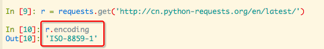
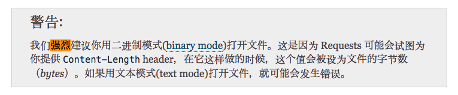
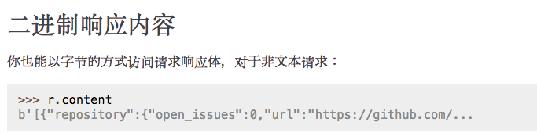

# Python2 `requests`库抓取网页出现乱码
> 练习抓取网页时遇到的，如果是简书等这些标准网站，正常抓取是没问题的。但是很多网页竟然怎么抓取都是所有中文都乱码。弄的我还以为是python代码本身的encoding问题。最后才追溯到原来是出现在源头requests库里面。

参考这两篇文章，[requests官方文档](http://docs.python-requests.org/zh_CN/latest/user/quickstart.html)， 和，[代码分析Python requests库中文编码问题](http://xiaorui.cc/2016/02/19/%E4%BB%A3%E7%A0%81%E5%88%86%E6%9E%90python-requests%E5%BA%93%E4%B8%AD%E6%96%87%E7%BC%96%E7%A0%81%E9%97%AE%E9%A2%98/)，非常有参考性。

第二篇文章中看到，很多网页实际上并不都是`utf-8`的编码格式，还有很多是`ISO-8859-1`格式，如下图：

但是，其实不是网页本身的问题！我们查看网页本身的`headers`发现，他们的`charset`值是`utf-8`，但是为什么用`r.encoding()`得到的却是`ISO-8859-1`呢？文章中指出原来是requests的bug，而且常年不解决。所以就需要我们自己来想办法。
我们不能手动去检查每一个网页的编码啊，那样太麻烦了。
官方文档中出现了这么一小句话，非常重要，亲测有效：

虽然这句话不是为了处理网页的，但是`二进制`！沿着这个思路，又在官网看怎么将网页获取为二进制模式的：

就是使用`r.content`获取。

