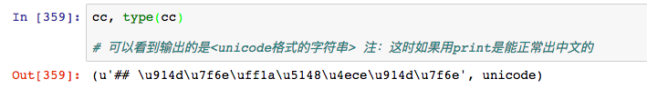
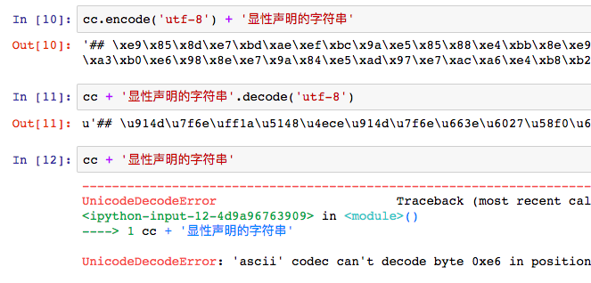
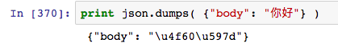
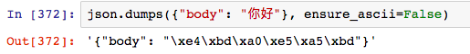
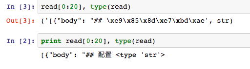

# ❖ Python2操作JSON出现乱码的解决方案

> 其实刚刚写过一整篇Python编码问题的解决方案，由于JSON又是一种特殊案例（与库相关，与语言本身无关）所以就单独提出来说。


## 我们来看一个从网上获取json并又存到本地文件的例子
```python
import requests,json

r = requests.get('https://api.github.com/repos/solomonxie/\
solomonxie.github.io/issues/25/comments')

# 获取到我的github中某条issue的所有评论，形式为<JSON格式的字符串>
comments = json.loads( r.content )

# 取某一条评论查看内容（中文）
cc = comments[0]['body'][0:10] # 取出的内容是'## 配置：先从配置'
```
然后来测试下变量cc：


### 好，到这里先停一下！
JSON的读取到目前为止，都是正常的：JSON Object对象给出的值都是unicode，没有被莫名转义，也没有报错误。
> 但是，unicode格式，意味着它和str格式不兼容！
这时，害羞的大姑娘Unicode刚出炉，你不能在这个时候让它和Str操作在一起！
报错也往往就在这种疏于防备的时候！

比如你看：



上面打印了三条Unicode和Str的结合，
前两条分别是以Str格式的结合，以Unicode格式的结合。
但是第三条，把两个不同格式的字符串结合，就出错了。

对不起，这里不是Javascript，变量不可以任意交合。Python对变量和编码都是极其谨慎的。

所以明白了这点，我们再继续。

### 上面获得了JSON Object对象，那么再来试试将`JSON对象`整体存到文本文件中。
如果要存到本地文件，那么就必须把Object对象转换为Str格式的字符串。
json库自带.dumps()函数可以进行转化。
但是这里问题出现了！我们来小试一下：

> 竟然连`print大法`都不能把`json.dumps()`返回的内容正确打印出来。经过各种测试和查看官网对于此函数的文档，发现：

### 原来`json.dumps()`是默认所有非ascii码强制转化为代号（而非汉字）的，于`repr()`效果等同！
[官方文档](https://docs.python.org/2/library/json.html#encoders-and-decoders)里有说明，`json.dumps()`里面有个`ensure_ascii`参数，默认为True。
意思就是默认把所有非ascii字码用`\`强制转化。所以，为了关闭这个功能，我们必须把它设为`False`.
下面是个小测试：


### 这样一来JSON在Python里的编码问题就解决了：须用`json.dumps(obj,  ensure_ascii=False)`来转化为字符串

下面是完整的代码测试：
```python
# @网络资源到本地存储真实测试
import requests,json

r = requests.get('https://api.github.com/repos/solomonxie/solomonxie.github.io/issues/25/comments')

# 获取到我的github中某条issue的所有评论，形式为<JSON格式的字符串>
comments = json.loads( r.content )

outgoing = json.dumps( comments, ensure_ascii=False )

with open('test.txt', 'w') as f:
    f.write(outgoing.encode('utf-8'))
with open('test.txt', 'r') as f:
    read = f.read()
    
print read[0:20], type(read)
```
来看结果：


## 大功告成！
