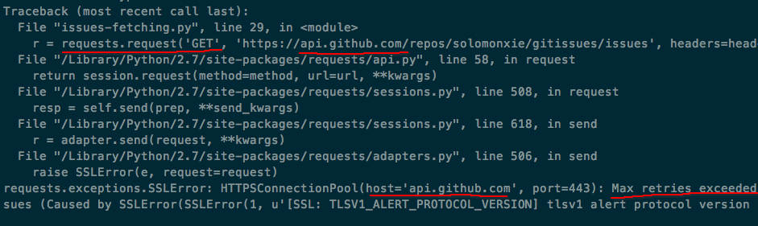

# 用requests报错`requests.exceptions.SSLError`

明明没有改代码，突然就报这种错误。
调查发现，原来是被服务器拒了。可能是今天来回调试，多次访问同一个地址，就被屏蔽了。
但是，同样是没有设置请求Headers的客户端postman和insomnia就还能正常访问，不知道为什么。
后来知道了，原来是服务器拒绝给我传送数据，因为访问量太大了！
Github的API是比较好的，它会在response中返回一个当前访问剩余量和下次能再次开始访问的时间。所以搞明白这个就知道，不是自己代码的事，而是访问量的事了。解决方法就是request访问时加上auth认证，这样就会从默认的每小时60次访问增加到每小时5000次。基本上够用了。
