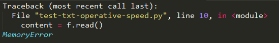

# Python 文件读取的练习

`原作于：Dec 6, 2015`

> 为了了解txt的读取速度，每一段都加上了时间计算

## 先练习了下基本的txt文件读写

``` python
start = time.clock()
f = open('hello.txt', 'r+')
f2 = open('hello2.txt', 'w')
f2.write(f.read())
f2.close
f.close()
end = time.clock()
print str(end - start)
```

## 然后是将14M的txt文件逐行复制到新文件的速度

``` python
start = time.clock()
f = open('hello.txt', 'r+') # 14M的txt文件
f2 = open('hello2.txt', 'w') # 逐行复制到新文件里
n = 0
while True:
    line = f.readline()
    n += 1
    if line:
        f2.write(line)
        #print '现在正在写入第 %s 行数据。' % n
    else:
        break
f2.close
f.close()
end = time.clock()
print str(end - start)
```


## 接着是生成1.4G的txt文件

``` python
start = time.clock()
f = open('hello.txt', 'r') # 原文件14M
f2 = open('hello-1g.txt','a')
content = f.read()
f.close()
# 想要生成1.4G的txt文件
# 用来测试各种方式读写大文件的速度
for i in range(1000):
    f2.write(content)
f2.close()
end = time.clock()
print str(end-start) # 用了446秒，无所谓了，主要是弄出一个1G的文件
```


## 用readline()来逐行读取1G文件的速度

``` python
start = time.clock()
f = open('hello-1g.txt', 'r')
print f.readline().decode('gb2312')
print f.readline().decode('gb2312')
print f.readline().decode('gb2312')
print f.readline().decode('gb2312')
print f.readline().decode('gb2312')
f.close()
end = time.clock()
print str(end-start) #用了0.08秒
```

时间是一瞬间吧，这样就看出来，其实不管txt文件多大，
只要用readline()一行一行读，就不占内存，也就是不影响速度。


## 用read()和来读取1G文件的速度

``` python
start = time.clock()
f = open('hello-1g.txt', 'r')
content = f.read() # print出1G是不可能的，直接赋予变量吧
f.close()
end = time.clock()
print str(end-start) 
```

呃，把1G的内容赋予变量——也就是一个变量在内存中占据1G以上的地盘，直接报错，如下图：


哈哈 ，这样一来，大概就明白了。
几十M的小文件的话，read()和readline()哪个都无所谓了，方便就行。
大文件的话，绝对不能read()直接读取。


## 源代码

``` python
# coding:utf-8
import time
##################################
"""
# 用read()和来读取1G文件的速度
start = time.clock()
f = open('hello-1g.txt', 'r')
#因为内容太长了，print是看不出处理速度的
#所以直接赋予变量了
content = f.read()
f.close()
end = time.clock()
print str(end-start)
"""
##################################
#"""
# 用readline()和来读取1G文件的速度
start = time.clock()
f = open('hello-1g.txt', 'r')
print f.readline().decode('gb2312')
print f.readline().decode('gb2312')
print f.readline().decode('gb2312')
print f.readline().decode('gb2312')
print f.readline().decode('gb2312')
f.close()
end = time.clock()
print str(end-start) #用了0.08秒
#"""
##################################
"""
start = time.clock()
f = open('hello.txt', 'r') # 原文件14M
f2 = open('hello-1g.txt','a')
content = f.read()
f.close()
# 想要生成1.4G的txt文件
# 用来测试各种方式读写大文件的速度
for i in range(1000):
    f2.write(content)
f2.close()
end = time.clock()
print str(end-start) # 用了446秒
"""
##################################
"""
start = time.clock()
f = open('hello.txt', 'r+')
f2 = open('hello2.txt', 'w')
n = 0
while True:
    line = f.readline()
    n += 1
    if line:
        f2.write(line)
        #print '现在正在写入第 %s 行数据。' % n
    else:
        break
f2.close
f.close()
end = time.clock()
print str(end - start)
"""
##################################
"""
start = time.clock()
f = open('hello.txt', 'r+')
f2 = open('hello2.txt', 'w')
f2.write(f.read())
f2.close
f.close()
end = time.clock()
print str(end - start)
"""

```

