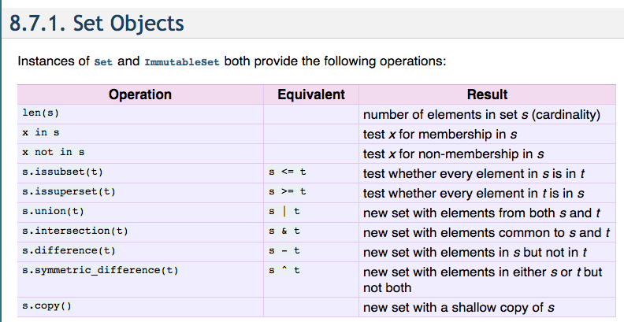
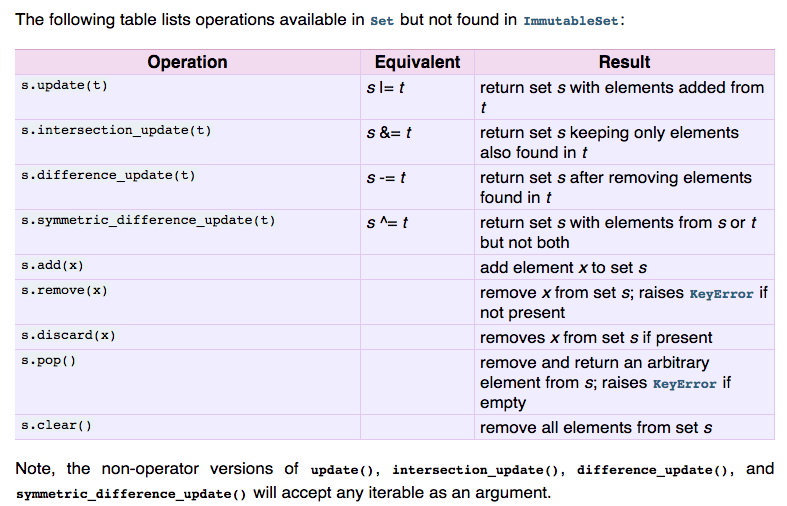

# Python集合的操作
> 有时候在对比两个数组，如果运用上集合的话就会相当精妙。

### 基本操作
[参考文章](http://blog.csdn.net/business122/article/details/7541486)
```python
s = set([3,5,9,10])
t = set([1,2,3,4,5,6,7,8,9,10])

# 基本运算
a = t | s          # t 和 s的并集  
b = t & s          # t 和 s的交集  
c = t – s          # 求差集（项在t中，但不在s中）  
d = t ^ s          # 对称差集（项在t或s中，但不会同时出现在二者中） 

# 基本操作：  
t.add('x')            # 添加一项  
s.update([10,37,42])  # 添加多项  
t.remove('H')     #删除一项
```
以下来自[官方参考](https://docs.python.org/2/library/sets.html)：





