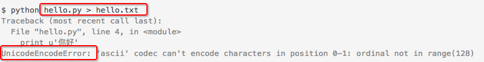

# ❖ Python执行脚本将输出重定向时编码错误

> 原本以为python内部的编码问题解决了，但是用linux命令将标准输出重定向时没想到又遇到了亲切的编码问题。



根据[文章](http://www.708luo.com/posts/2014/06/python-print-encode-error/) 和 [文章](https://mozillazg.com/2014/01/python-fix-shell-python-program-redirect-to-file-raise-unicodedecodeerror)的解释，是因为linux的重定向命令并不知道python文件的输出编码而默认使用了ascii，所以当输出有超出128的字都会报错。
解决方法很简单：

在执行python的命令前加上`env PYTHONIOENCODING=utf-8`，如：
```shell
env PYTHONIOENCODING=utf-8 python ~/hello.py >> log.txt
```

还可以分开写：
```
$ export PYTHONIOENCODING=utf8
$ python hello.py  > hello.txt
```

这里还有一些相关的[stackoverflow回答](https://stackoverflow.com/questions/3828723/why-should-we-not-use-sys-setdefaultencodingutf-8-in-a-py-script)。

## 这还是不能输出所有内容
因为linux输出重定向的道理（在刚刚写的Linux学习的篇章里有专门说明），光是编码还不行，会发现还有很多内容并没有转向到文件里，而还是显示在屏幕上了。
其实我们上面写的转向语句，只是把显示在屏幕上的`stdout`标准输出转向了日志文件，可是还有`stderr`标准错误没有转向到日志文件，所以才显示到了显示屏里。
虽然看上去很多内容看起来并不是错误，比如`git push`的正常返回，好像和`stderr`标准错误没什么关系，可是它们本质上是通过`stderr`输出到屏幕的，只是我们不知道而已。
所以这时候，
应该把标准错误合流到标准输出里，一起转向。
在命令的结尾加上`2>&1`，让2转向1，意思就是让标准错误转向至标准输出。其中`>`代表`Redirect to`，`&`没意义只是用来告诉系统后面的1是代表输出设置，而不是文件名。

用上面的例子，这里应该这样写：
```shell
env PYTHONIOENCODING=utf-8 python ~/hello.py >> log.txt 2>&1
```

然后，哒哒！屏幕上不会显示任何内容了！也就是说所有的东西都转向了log.txt文件里保存。
