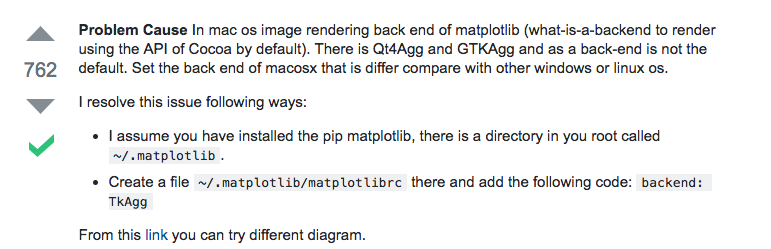

# Python运行`matplotlib`时报错：`Python is not installed as a framework.`

[参考这篇回答](https://stackoverflow.com/questions/21784641/installation-issue-with-matplotlib-python)。
即使我的matplotlib是在virtualenv虚拟环境里安装的，它还是会在用户目录下生成一个`~/.matplotlib`目录。
然后我们在创建一个文件并填入一句话：
```
touch vim ~/.matplotlib/matplotlibrc
echo "backend: TkAgg" > ~/.matplotlib/matplotlibrc
```


