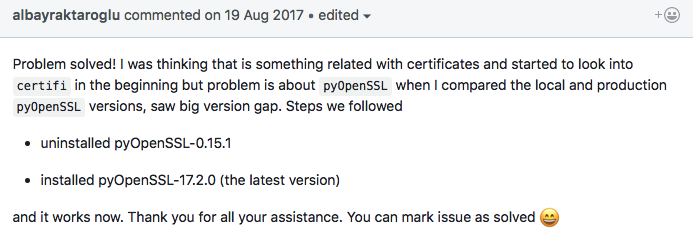

# Python requests返回`Max retries exceeded`错误
经常在脚本访问API时接受到这个反馈，这个可以理解因为一般一个ip太频繁访问某个网址就会被服务器拒绝。
但是比如我访问Github的API，明明已经通过认证且每小时5000次访问量了，怎么会没消费掉访问量就被返回`Max retires`呢。
查了很多文章，大家只是说让requests去sleep一会儿再访问，但是这不是正确的解决方案。
最后通过这个回答，真的一键解决了：

也就是，安装这个包就好了：`pip install pyopenssl`或`pip install -U pyopenssl`。也就是当时报错里提示的关于`SSL`的什么东西，这样就解决了。
