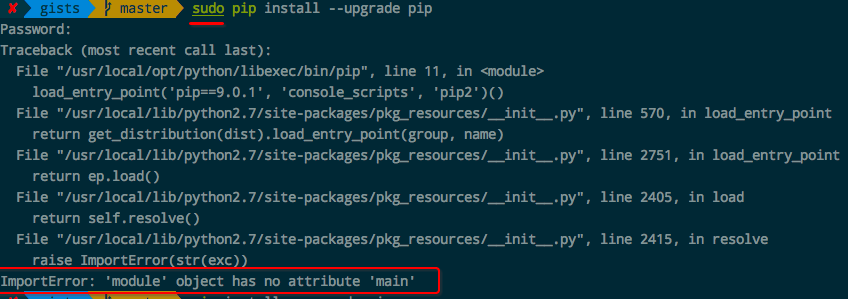

# 升级`pip`报错：`ImportError: module 'pip' has no attribute 'main'`
[参考：解决 ImportError: module 'pip' has no attribute 'main'](https://blog.csdn.net/Jiaach/article/details/80188262)

正在用pip（没有在虚拟环境中，直接在系统里操作的），提示我可以将9.9升级到10.0，然后就`sudo pip install --upgrade pip`了，结果就报这个错误，导致所有的pip操作都无法进行。找到解决方案如下：




```shell
## 如果报权限错误 则加上sudo
curl https://bootstrap.pypa.io/get-pip.py -o get-pip.py;python get-pip.py
```
完成。


