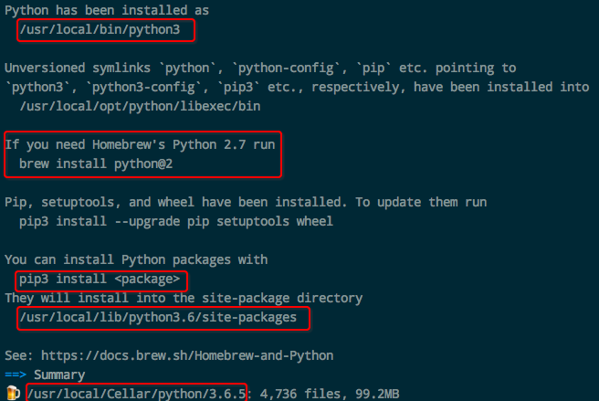
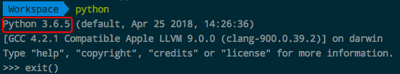
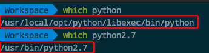
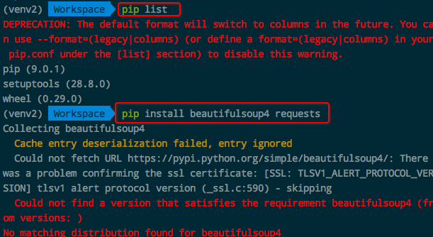

# ❖ Virtualenv创建Python3环境

## Mac安装Python3
> 注意，一般没什么人会完全删除Python2.7而只用Python3， 所以几乎都是同时安装Python2.7和Python3.

[参考官方文档：在Mac OS X上安装Python 3](http://pythonguidecn.readthedocs.io/zh/latest/starting/install3/osx.html)

一般Ubuntu或Mac默认是Python2.7， 所以需要先安装系统的Python3环境，Virtualenv才能够通过它来创建虚拟环境。需要注意的是，不同系统和不同包管理器的安装方式不一样，注意你选择的安装方法一定不能和Python2.7冲突。
Mac的话，需要麻烦一点，
`brew install python3`是行不通的，因为会提示`Error: python 2.7.14_3 is already installed. To upgrade to 3.6.5, run `brew upgrade python.`
具体操作如下：
```shell
$ brew upgrade python

#==> Upgrading 1 outdated package, with result:
#python 2.7.14_3 -> 3.6.5
```
然后很快就安装成果，并显示如下：


这个时候在命令行里输入`python`，就会直接跳入python3的编程环境了。


然后我们通过`which`命令，得知两种版本python的位置，便于之后virtualenv的设置：


## 安装Python3环境的Virtualenv
这个时候已经保证了本机同时存在Python2.7和Python3，那么安装虚拟环境就简单多了：
```shell
# 创建虚拟环境
$ virtualenv -p python3 ~/FOLDER-PATH/venv3
# 或更具体的指定路径（同样适用于Python2的安装）
$ virtualenv -p /usr/local/opt/python/libexec/bin/python ~/FOLDER-PATH/venv3

# 进入虚拟环境
$ source ~/FOLDER-PATH/venv3/bin/activate

# 退出环境
deactivate
```
然后就在你自己定义路径下添加了一个`venv3`文件夹，这就是你的虚拟环境啦。
每次只需要`source ~/FOLDER-PATH/venv3/bin/activate`就可以进入Python3的虚拟环境了。
当然，为了简单，我把这么长的一句话设置成为alias，一句`venv3`就可以简单进入环境。

## Python3虚拟环境下安装包
Python3的环境下，是需要用`pip3`来安装各种包的。

## 升级至Python3后Python2的异常
Mac中升级到Python3后，原本的`python`命令行关键字被直接指定为`python3`，而原有的python2需要通过`python2.7`来进入python2.

### 原来Virtualvenv的Python2环境下无法用pip安装包

错误原文如下：
```shell
$ pip install requests
Collecting requests
  Could not fetch URL https://pypi.python.org/simple/requests/: There was a problem confirming the ssl certificate: [SSL: TLSV1_ALERT_PROTOCOL_VERSION] tlsv1 alert protocol version (_ssl.c:590) - skipping
  Could not find a version that satisfies the requirement requests (from versions: )
No matching distribution found for requests
```

解决方案：在这个虚拟环境下，重新安装一下pip就好了：
```shell
$ curl https://bootstrap.pypa.io/get-pip.py >> get-pip.py
$ python get-pip.py

# 必要的时候升级下pip
$ pip install --upgrade pip
```
完成，顺利安装好后就能顺利install包了。


