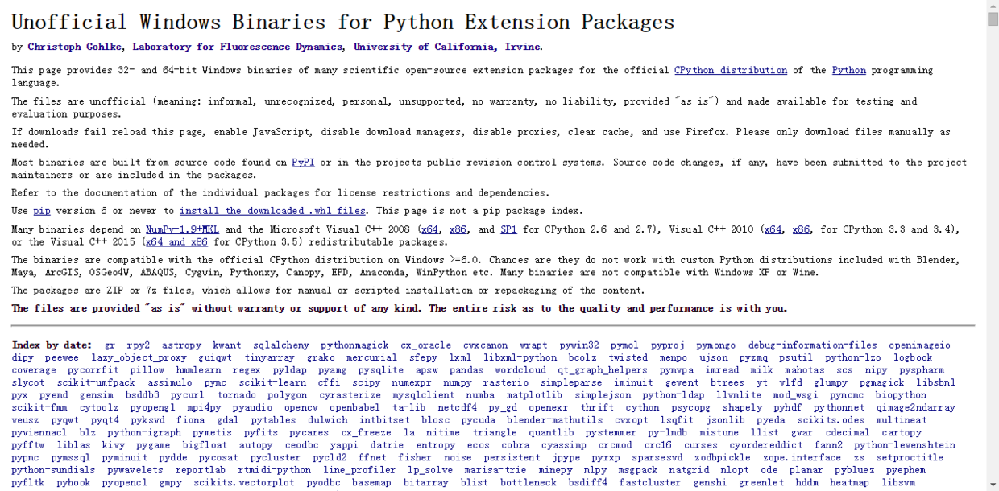

# ❖ Python 安装Mysql模块及安装中错误的解决 (Windows)

初试爬虫之后，各种快感。然后进入到Python练习的下一阶段了——把抓取到的数据存到数据库中。
再三考虑，还是决定从MySQL开始入手。虽然评论区很多倾向于SQLite及MongoDB等新潮玩意，但是MySQL还是占有决定性的市场。为了适应以后生存，这方面必须得会，就拿它先练手吧。

> 我的开发环境是中文win7系统32位， Python 2.7, MySQL 14.4。（Linux在虚拟机里呢，熟练之前先不挑战开发环境了-_-!）
> 注意：这里是安装python的`mysql模块`，而不是mysql, 到了这一步它应该是已经安装好了的（包括`MySQL Server`和`MySQL python connector`）。

**先检查自己是不是已经安装了这个模块**
极其简单：在Python的命令行中输入`import MySQLdb`，如果没有报错，那就已经安装了。
## 最简单的安装方法

其实就是随便找个地方按下`win+R`，输入`cmd`回车——打开windows命令行，进行著名的`pip安装大法`：  

> pip install mysql-python

按理来说，这一步足够了。但是我这出现了据说在windows环境下python安装模块的痛：命令行里返回了错误：

> error: Unable to find vcvarsall.bat

然后我想到，是不是在windows用`pip`不太合适？所以还是循规蹈矩地到[Python官网下载](https://pypi.python.org/pypi/MySQL-python/1.2.5#downloads)了MySQLdb的_源文件_，即[MySQL-python-1.2.5.zip](https://pypi.python.org/packages/source/M/MySQL-python/MySQL-python-1.2.5.zip#md5=654f75b302db6ed8dc5a898c625e030c) ([md5](https://pypi.python.org/pypi?:action=show_md5&digest=654f75b302db6ed8dc5a898c625e030c))这个压缩包。
随便找个地方解压缩，然后以最快的速度在cmd命令行中进入这个目录，输入：

> python setup.py build
> python setup.py install

按理来说，到这一步就完全成功了。不过，返回的结果是一毛一样的。。。

> error: Unable to find vcvarsall.bat

然后我就知道了：其实`pip`安装，和我自己下载源码用`python setup.py build` 、 `python setup.py install`是一样的效果。
问题源头还是在`vcvarsall.bat`这个东西上。一看文件名就知道是和vc相关。
查询相关资料，说是[凡是安装和操作系统底层密切相关的Python扩展，几乎都会遇到这个错误。](http://blog.csdn.net/secretx/article/details/17472107)
经过搜索，绝大多数的回答都是：需要安装`Microsoft Visual Studio`2008或者2010版本，才能满足Python在windows系统上安装各种底层扩展的需要。
正在下载2G的VS中。。。
**不过趁着下载等待时间，我在评论区发现了更easy的方法。。。。**

打开页面，http://www.lfd.uci.edu/~gohlke/pythonlibs/ 是这个模样：

满屏幕毫无美感的英文，连排版都没有，真有点不太好接受。不过趁着VS还没下载完，就简单读了读，发现了第二行关键词：`University of California, Irvine.`，原来是加大的作品啊，一看就是科学家制作，比较大气，耐着心读了读说明段落——好像是专门针对windows对python支持性差做的工作——把python扩展都制作成了**二进制文件**，即`.whl`文件。
## 安装二进制的Python扩展包

看起来好像是个好东西，就`ctrl+f`查找mysql，还真找到了！

> MySQL-python, a Python database API 2.0 interface for the MySQL database
> Mysqlclient is a Python 3 compatible fork of MySQL-python.
> MySQL_python-1.2.5-cp27-none-win32.whl
> MySQL_python-1.2.5-cp27-none-win_amd64.whl

选择`win32.whl`这个文件下载，才772k。
但是这个`whl`文件格式怎么安装呢？回到网页上面，发现说了是用pip安装，于是我在这个目录打开cmd命令行，输入：

哈哈，献丑了！`whl`文件的安装方法，在`pip`的官方文档里说明的很清楚([看这里](https://pip.pypa.io/en/latest/user_guide/#installing-from-wheels))
所以再来了一遍：
输入：

> pip install MySQL_python-1.2.5-cp27-none-win32.whl
> 返回：
> Processing c:\tdownload\mysql\mysql_python-1.2.5-cp27-none-win32.whl
> Installing collected packages: MySQL-python
> Successfully installed MySQL-python-1.2.5

安装成功！

到Python里面试了一下`import MySQLdb`，也正常！
于是乎，我觉得写文章的这个功夫，已经下载好的Microsoft Visual Studio也没必要了。。。。

