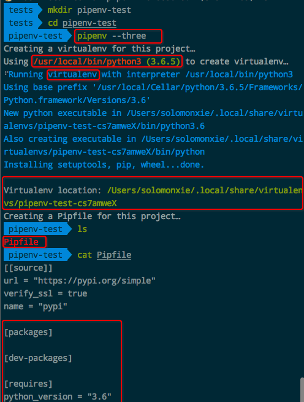
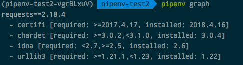

# ❖ pipenv虚拟环境全方位入门

> 2018的PyCon把最新型最先进的Python虚拟环境`pipenv`吵得火热。看了下介绍感觉真的很好用，它在`virtualenv`的基础上包装了一些更便捷的功能，解决了很多很多`virtualenv`欠缺的事情。

[参考pipenv的前世今生：PyCon 2018 之 Python 未来的依赖管理工具 pipenv](https://juejin.im/post/5b07620a518825389f5f4bb5)
[参考：pipenv 更优雅的管理你的python开发环境](https://segmentfault.com/a/1190000012837890)
[直接参考创造者Kenneth的官方说明](https://github.com/pypa/pipenv)

简单说，`pipenv`就是把`pip`和`virtualenv`包装起来的一个便携工具。

它不会在你的项目文件夹里生成一大堆东西，只有两个文本文件：
- `Pipfile`, 简明地显示项目环境和依赖包。
- `Pipfile.lock`, 详细记录环境依赖，并且利用了hash算法保证了它完整对应关系。只在你使用`pipenv lock`命令后才出现。

### 安装
Mac安装很简单，只要用Homebrew：
```shell
$ brew install pipenv
```

Linux的话，是用pip安装：
```
$ pip install --user pipenv
```
安装好后，终端里还调取不了命令，因为它现在只是个包。
需要先找到它的真是路径，然后为了方便把它加到bash或zsh等shell里面：
```sh
# 先获取python包的位置
$ python -m site --user-base
```
比如我的显示在`/home/pi/.local`，那么pipenv就藏在`/home/pi/.local/bin`里。
所以需要打开shell的设置文件，比如bash的话就编辑`~/.bash_profile`, zsh的话就编辑`~/.zshrc`，在里面把刚才查到的包路径存进去：
```
alias pipenv="home/pi/.local/bin/pipenv"
```
注意：我没有像其他人一样整个export进去，因为不知道为什么树莓派里面的zsh使用不来这个。


## 创建虚拟环境
在某个文件夹创建一个Python3环境：
```shell
# 泛指python的版本
$ pipenv --three

# 或者，特指某个python版本
$ pipenv --python 3.5

# 或者，特指某个位置的python
$ pipenv --python <path/to/python>
```
然后就会显示如下动态，可以看出来，`pipenv`调用了`virtualenv`，从本机把Python3环境拷贝一份到某个本机位置，然后在你的项目文件夹里只创建了两个文件`Pipfile`和`Pipfile.lock`，记录了所有你这个项目需要的环境配置，内容极其简单易懂：



### 显示当前虚拟环境的储存位置
```sh
$ pipenv --venv
```

### 运行环境
运行虚拟环境(无需进入特定shell即可按照该环境运行脚本)：
```sh
$ pipenv run python xxx.py
```

### 进入环境
进入虚拟环境：
```shell
# 进入虚拟环境
$ pipenv shell

# 退出虚拟环境
$ exit
```
其实进入`pipenv`虚拟环境，本质上就是`virtualenv`的`source ./bin/activate`动作，只是使用不一样。进入后，你会发现用`deactivate`也是能生效的。但是：

注意：进入`pipenv`环境后千万不要用`deactivate`退出，而应该用`exit`退出。否则你再进去这个环境就会产生错误：
```
Shell for UNKNOWN_VIRTUAL_ENVIRONMENT already activated. 
No action taken to avoid nested environments.
```

### 安装packages包
```shell
$ pipenv install <包名>
```

你需要知道的是，进入pipenv虚拟环境后，你还是可以用`pip install`来安装包的，也能正常使用，因为virtualenv就是这样做的。
但是，这样你就不算使用了`pipenv策略`了，如果你要在项目文件夹里的`Pipfile`记录所有项目需要的依赖环境，就应该放弃使用`pip install`而使用`pipenv install`，这样你的`Pipfile`就会精确记录所有需要的依赖。

重新安装所有packages：
有时候需要冲github上clone项目，下载好后，只需要一句话就可以完成创建环境：
```sh
# 根据Pipfile中的描述安装所有依赖
$ pipenv install

# 或者，根据Pipfile.lock中的描述安装所有依赖
$ pipenv install --ignore-pipfile

# 或者，只安装dev组的依赖
$ pipenv install --dev

# 或者，根据曾经在pip上导出requirements.txt安装依赖
$ pipenv install -r <path-to-requirements.txt>
```

### 按照树形结构显示当前环境的依赖关系：
```sh
$ pipenv graph
```
然后就会显示出如下效果：


### 删除虚拟环境：
```sh
# 删除某个包
pipenv uninstall <包名>

# 删除整个环境
$ pipenv --rm
```

## `pipenv lock`时遇到的SSL Error
错误反馈如下：
```
Pipfile.lock not found, creating…
Locking [dev-packages] dependencies…
Locking [packages] dependencies…
usr/local/Cellar/pipenv/2018.5.18/libexec/lib/python3.6/site-packages/pipenv/vendor/requests/sessions.py", line 508, in request
    resp = self.send(prep, **send_kwargs)
  File "/usr/local/Cellar/pipenv/2018.5.18/libexec/lib/python3.6/site-packages/pipenv/vendor/requests/sessions.py", line 618, in send
    r = adapter.send(request, **kwargs)
  File "/usr/local/Cellar/pipenv/2018.5.18/libexec/lib/python3.6/site-packages/pipenv/vendor/requests/adapters.py", line 506, in send
    raise SSLError(e, request=request)
requests.exceptions.SSLError: HTTPSConnectionPool(host='pypi.org', port=443): Max retries exceeded with url: /pypi/pyobjc-framework-netfs/json (Caused by SSLError(SSLError(1, u'[SSL: TLSV1_ALERT_PROTOCOL_VERSION] tlsv1 alert protocol version (_ssl.c:590)'),))
```
[参考`pipenv`的issue解答。](https://github.com/pypa/pipenv/issues/836)

最佳解决方案是：
```sh
$ pip install pyopenssl
```
因为这种SSL Error在其他地方也常见，一般都是没有在环境里安装`pyopenssl`的问题。所以不管你在哪个环境，如果出现这个SSL问题，就先装`pyopenssl`解决。
注意：不要用`pipenv install pyopenssl`，因为你真的不想在每个环境里都重新装一遍这个，干脆把它撞到本机：`$ pip install pyopenssl`.

## 常见错误操作

### 不要在”pipenv shell“里面运行“pipenv install”
尽量不要这样做，因为没有必要。
不过也有一些特殊情况，是需要这样做的：比如我在安装`Pillow`包的时候，只有在`pipenv shell`里面才能够安装成功。

### 不要在”pipenv shell“里面运行”deactivate“

