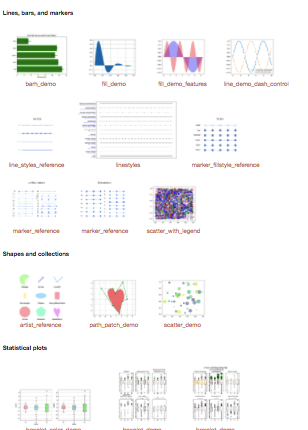

# 什么是`matplotlib`
说白了就是Python用来画图的库，画数学图。鼎鼎大名，功能强大。说成是Matlab替代品其实也行。

参考[中文文档](http://old.sebug.net/paper/books/scipydoc/matplotlib_intro.html)。
> matplotlib 是**python最著名的绘图库**，它提供了一整套和matlab相似的命令API，十分适合交互式地进行制图。而且也可以方便地将它作为绘图控件，嵌入GUI应用程序中。
它的文档相当完备，并且[Gallery页面](https://matplotlib.org/gallery.html#lines_bars_and_markers) 中有**上百幅缩略图**，打开之后都有源程序。因此如果你需要绘制某种类型的图，只需要在这个页面中浏览/复制/粘贴一下，基本上都能搞定。

[上百幅官方绘图参考](https://matplotlib.org/gallery.html#lines_bars_and_markers)。

