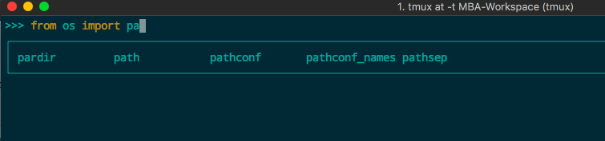
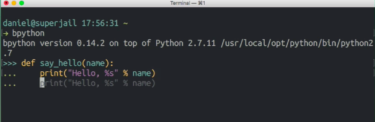

# bpython: Python shell高亮

看到Youtube一个视频，有人在python shell里面竟然有各种高亮和提示，非常方便。查了下发现是一个python包：`bpython`

所以无视你在什么环境，python2/3/virtualenv等，只要你在相应的环境下安装就可以使用了：
```sh
$ pip install bpython
```

完成后，运行`bpython`即可进入。

记住：iTerm2是bpython的最好伙伴。






