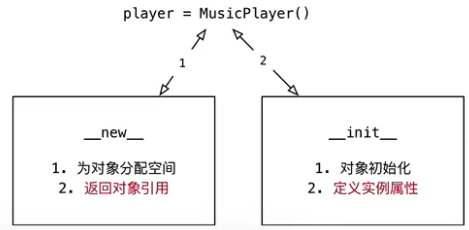
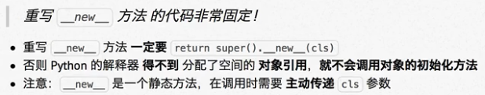
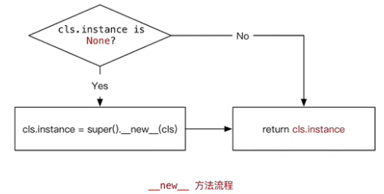

# ❖ Python单例设计模式

[参考：黑马程序员教程 - Python基础 面向对象](http://yun.itheima.com/course/273.html)

单例指一个对象只生成一个实例，也就是说对象只会在内存中分配一块区域。比如Music player，一次只能播放一个歌曲，只分配一块内存给它，不能同时播放两首歌。只有当它销毁了，才会生成一个空间给另一首歌。



要想达到`单例`这种效果、这种设计模式，就需要涉及内存分配问题。既然涉及到内存分配问题，就需要用到对象的内置函数中涉及内存分配的`__new__`函数来完成。

`__new__`方法有两个作用：
- 在内存中为`对象`分配空间
- 返回`对象`的引用

而实现`单例设计模式`，就是对`__new__`方法的**`重写`**！

重写__new__方法时需要注意：


如果没有在重写__new__时候返回`对象引用`，那么在生成实例时，就只能得到一个`None`。

重写单例对象的__new__方法的固定格式（必须要遵守）：
```py
def __new__(cls, *args, **kwargs):
    # Your code
    # ........
    # ........

    # Return the generated instance of the object
    return super().__new__(cls)
```


如果在__new__中实现单例的设计模式呢？
主要思路如下：
- 添加一个`类属性`
- 将这个类属性的初始值为None
- 如果有实例被创建，这个类属性就为
- 再有实例被创建时，如果发现类属性为None，则不创建，且返回之前已创建的实例



代码如下(非常固定，没什么需要改的）：
```py
class MyClass(object):

    instance = None

    def __new__(cls, *args, **kwargs):

        if cls.instance is None:
            cls.instance = super().__new__(cls)
            
        return cls.instance
```
