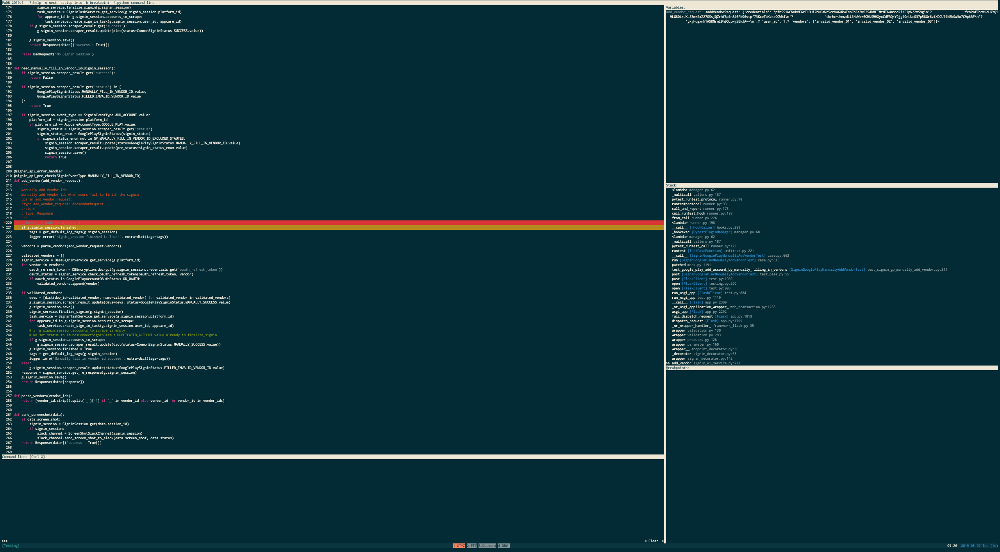

# pudb: Python Debugger With a Better Interface [DRAFT]


## Work with pytest

```sh
# Install
$ pip install pytest-pudb

# xx.py: Set breakpoint in code
__import__('pudb').set_trace()

# Run pytest through `py.test`
$ py.test -sv /path/to/tests
```


## Navigate


## Preference

`Ctrl-p` to edit preferences.


## Themes

### Midnight


