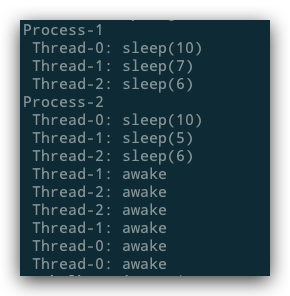

# Python threads inside of a sub-process

```
import random
from time import sleep
from multiprocessing.pool import ThreadPool
from multiprocessing import Process


def f(index):
    t = random.randint(1, 10)
    print(f' Thread-{index}: sleep({t})')
    sleep(t)
    print(f' Thread-{index}: awake')


def run(n):
    print(f'Process-{n}')
    pool = ThreadPool(3)
    for i in range(3):
        pool.apply_async(f, args=(i,))
    pool.close()
    pool.join()


p1 = Process(target=run, args=(1, ))
_ = [p1.start() and p1.join() and p1.close()]
sleep(0.1)
p2 = Process(target=run, args=(2, ))
_ = [p2.start() and p2.join() and p2.close()]
sleep(0.1)
```

Result:



## Bug:

```
_ = [p1.start() and p1.join() and p1.close()]
```
This won't work because of the `and`
