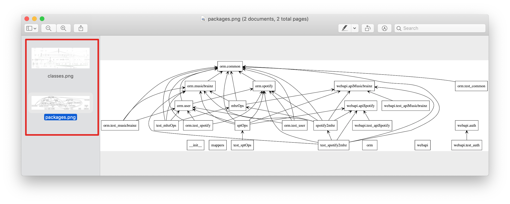

# Python 静态代码检查 [DRAFT]

[参考：让 Python 代码更易维护的七种武器](https://zhuanlan.zhihu.com/p/45671766)
[参考：Python 常用静态代码检查工具](https://juejin.im/entry/5b59215d6fb9a04f90791821)

- PyLint
- PyFlakes
- Flake8
- PyReverse
- Autopep8
- coverage


## PyLint

```

```

## PyFlakes

```

```


## Flake8

安装：
```sh
pip install flake8 --user
```

一行内容过长问题：如果是字符串过长，可以选择忽略。方法是在expression结尾加入`  # NOQA`忽略这行的检查。注意：# 前有两个空格


### 配置文件

[参考：Flake8 configuration](http://flake8.pycqa.org/en/2.6.0/config.html)

系统级别配置文件：`~/.config/flake8`
项目配置文件：项目根目录下`setup.cfg`，或`tox.ini`, `.pep8`, `.flake8`

最简单配置：
```ini
[flake8]
max-line-length = 120
```


## AutoPEP8

PyLint、PyFlakes等，只能检测到问题，但还是要我们手动一个一个去改。如果数量巨大，全都是空格一类到小问题，是非常费时间的。所以`autopep8`能够帮我们自动把那些空格、换行一类的问题解决。

> 很多人怕代码被动了以后会出毛病，其实不用担心，因为只要是在git追踪下，就不怕。我们可以在修正完成后，用`git diff <FileName>`来查看修正了哪里，如果认可的话，就`git add <FileName>`加到栈里，全部检查完成后在commit。一旦出现问题，还可以随时checkout回滚到正常版本。

修正单个文件：
```sh
$ autopep8 --in-place --aggressive --aggressive <FileName>
```

批量修正项目中所有Python代码：
```sh
$ autopep8 --in-place --aggressive --aggressive -r ./
# or
$ find . -name "*.py" | xargs autopep8 --in-place --aggressive --aggressive <FileName>
```

## PyReverse

`PyReverse`是安装`pylint`后自带的程序，能够根据项目代码生成UML关系图。

需要安装`graphviz`支持生成图形。

命令：
```sh
$ pyreverse -ASmy -o png /path/to/project
```

执行后会在文件夹生成两个图片文件：



## Coverage

检查测试代码覆盖率。

[参考：测试用例覆盖率coverage工具使用](https://www.jianshu.com/p/307bcf8a6ac8)

检查整个文件夹:
```sh
$ cd /path/to/project
$ coverage report  # 无需指定目录位置
```

检查单个文件：
```sh
$ coverage report -m <FileName>
```
