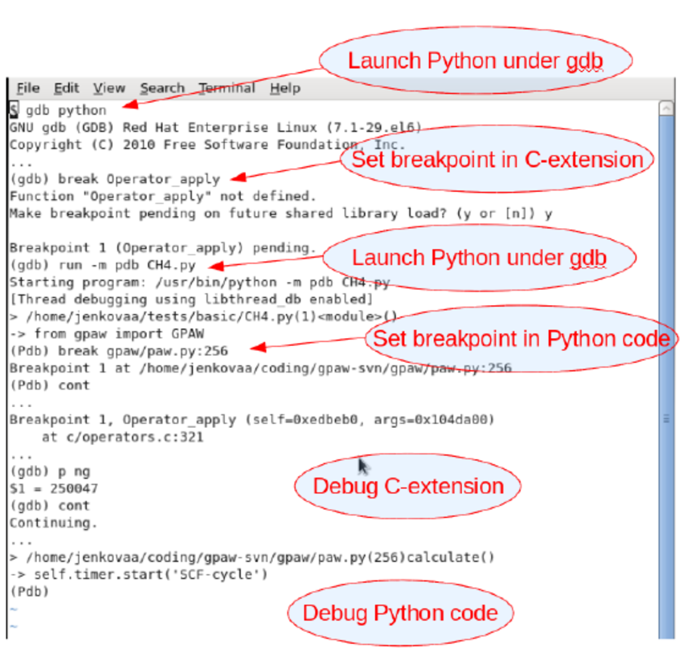

# Debugging for Python C Extension [DRAFT]

Observation:
- If you use `pdb` to debug in the python wrapper of C code, you can't `step in` the function if it's a function from a C extension. `pdb` will **skip** the c function.
- You can `printf(..)` in the C code to do basic debugging.

Not sure if this works:

