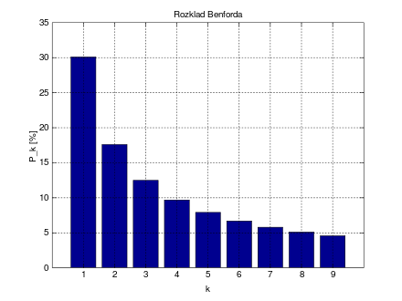
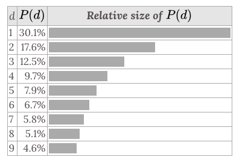

# Benford's Law

> It's also called `Newcomb-Benford's Law`, `Law of Anomalous Numbers`, and `First-Digit Law`.

[Refer to wiki: Benford's law](https://www.wikiwand.com/en/Benford%27s_law)

It is an observation about the frequency distribution of leading digits in many real-life sets of numerical data.

The first digits of data entries in most real-world data sets are not uniformly distributed. The most common first digit is **1**, followed by **2**, and so on, with **9** being the least common first digit. This phenomenon is known as `Benford's Law`.

The leading digits in such a set thus have the following distribution:

