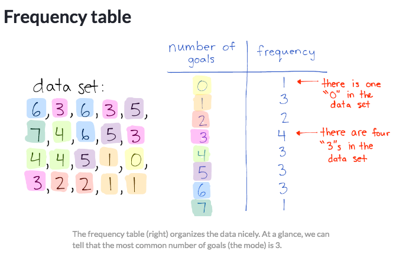
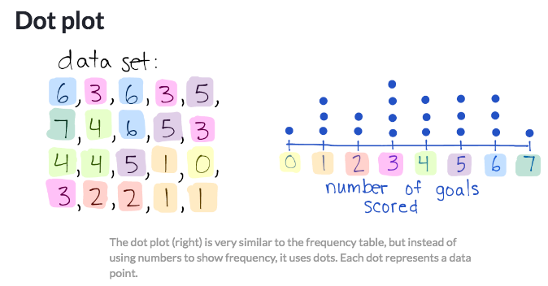
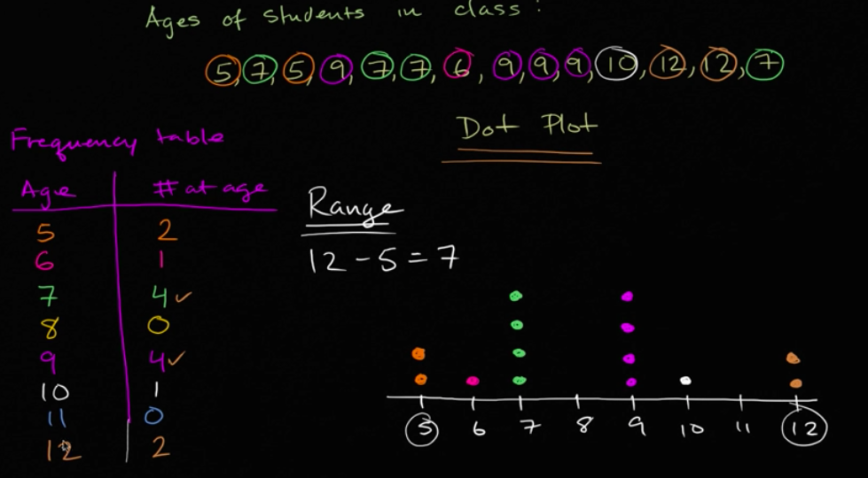

# Frequency Table & Dot plot

[Refer to Khan academy: Frequency tables & dot plots](https://www.khanacademy.org/math/ap-statistics/quantitative-data-ap/modal/v/frequency-tables-and-dot-plots)
[Refer to Khan academy review: Dot plots and frequency tables review](https://www.khanacademy.org/math/statistics-probability/displaying-describing-data/modal/a/dot-plots-and-frequency-tables-review)

