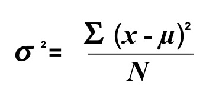
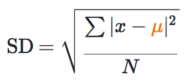
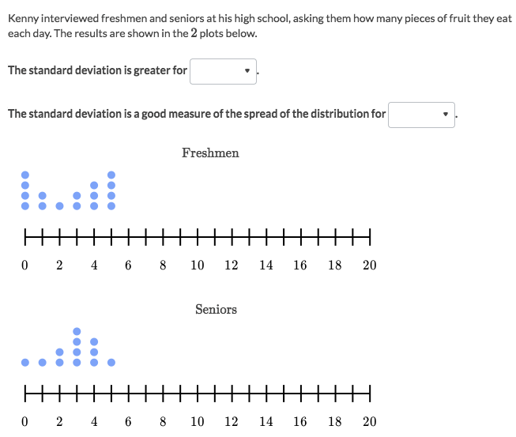

#  「Variance」 Deviation
In mathematics and statistics, deviation is a measure of difference between the observed value of a variable and some other value, often that variable's mean.

- **Larger deviation** means the distribution **spread wider**.
- **Smaller deviation** means the distribution **stick closer**.

## 「Standard Deviation」
> Also called `Standard Variance`.

[Refer to Khan academy review: Calculating standard deviation step by step](https://www.khanacademy.org/math/probability/data-distributions-a1/summarizing-spread-distributions/a/calculating-standard-deviation-step-by-step)

(▲ where `∑` means "sum of", `x` is **each value** in the data set, `μ`(mu) is the **mean** of the data set, and `N` is the amount of data points in the population.)

Steps:
- Find the **mean**.
- Find the **distance** from each value to the mean.
- Find the **average of all squared distances**.
- Find the root of the average.

### Example

Solve:
- By eyeballing, for Freshmen most of the data are not clustered around the mean.
- But for Seniors, most of the data points are clustered around the centre.
- So Freshmen has greater Standard Deviation.
- The seniors' data resembles a `Normal Distribution`, in which the Standard Deviation is a good measure for the **spread**.
