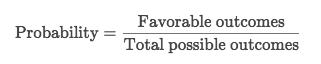
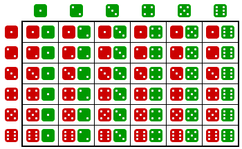
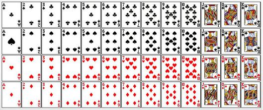
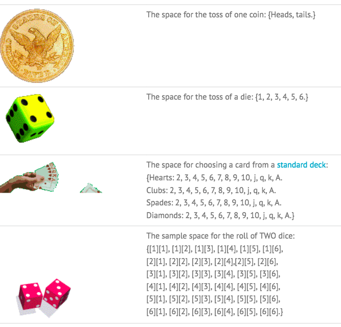
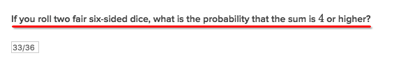
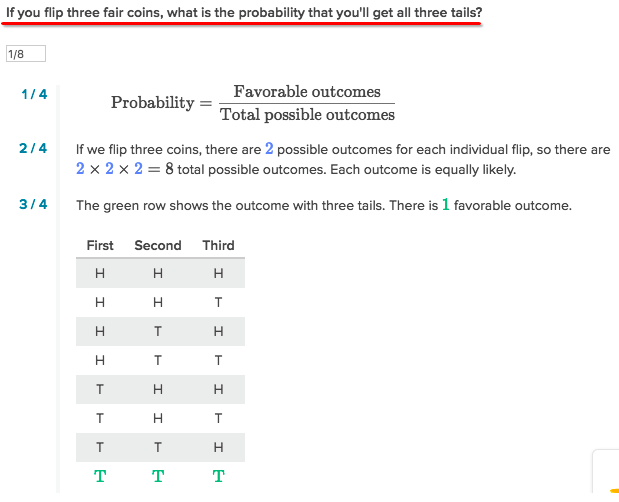
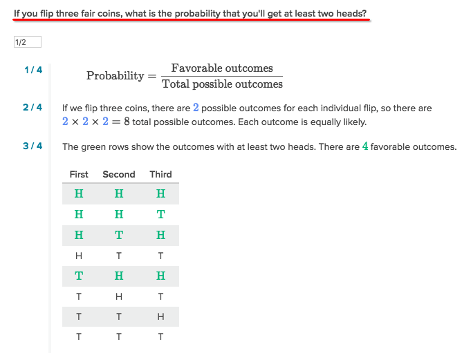

#  ❖ Intro to Probability [DRAFT]

> It's easy but always confusing if you haven't yet totally understood it in the first place.

The very first thing to do for solving a probability problem, is to CATEGORISE the problem and apply different formula.

- Single Event
- Single Event Repeats
- Independent Events in Sequence

## 「Single Event」

- The probability of an event can only be **0 to 1**  (or 0% to 100%).
- The probability of event **`A`** is often written as **`P(A)`**.
- The probability of an event with condition is often written as **`P(condition)`**.

Common cases:
- Flip a coin:  P(head) = 1/2.
- Roll a die: P(>3) = 3/6

#### 「Theoretical Probabilities」 & 「Experimental Probabilities」

The formula `Fav outcomes / Total outcomes` only gives you the `Theoretical probability`.
But when you do some experiments, like flip a coin 10,000 times, 
and you may find out the probability of the result of experiments is way so different than the theoretical one.

### 「Single Event Repeats」

Example: `Roll a die 100 times, how many times will you get a number greater than 3?`
Answer: P(>3) = 3/6 *100
The probability is 50 times.

## 「Multiple Events」

### 「Independent events」 in sequence

### 「Independency」

> To understand probability, we really need to differentiate `independent events` and `dependent events`.

[Khan lecture: `Compound probability of independent events`.](https://www.khanacademy.org/math/precalculus/prob-comb/compound-probability-of-ind-events-using-mult-rule/v/compound-probability-of-independent-events)

`Coin flips` are INDEPENDENT events: 
What happens in the first flip in no way affects what happens in the second flip.

And this is actually one thing that many people don't realise.

#### 「Gambler's Fallacy」

> There's someone who thinks, if he got a bunch of heads in a row, then all of a sudden, it becomes more likely on the next flip to get a tails. 

**THAT IS NOT THE CASE.**

**Every flip is an independent event.** What happened in the past in these flips does not affect the probabilities going forward.

## 「Sample Space」

A dummy method,  just to draw a table or a tree shows every outcome it could be, and pick out all favourable results.  

[Refer to Wiki: Sample Space](https://www.wikiwand.com/en/Sample_space)
[Refer to article: Sample Space Examples and The Counting Principle](http://www.statisticshowto.com/sample-space/)

The sample space of an experiment is all the possible outcomes for that experiment. 

(Rolling Two dice)

(52 card deck)

### 「Sample Size」
> It's also called the Size of Sample Space.

Simply to **MULTIPLY**.

> The Fundamental Counting Principle: If there are `a` ways for one event to happen, and `b` ways for a second event to happen, then there are `a * b` ways for both events to happen.

Sample problem: If shoes come in 6 styles with 3 possible colors, how many varieties of shoes are there?
All you need to do is multiply: 6 • 3 = 18 possible varieties of shoes.

### Example:

First to notice that, it's **ONE** event. 

### Example:

### Example:

