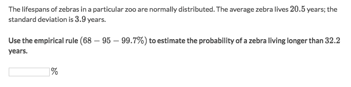
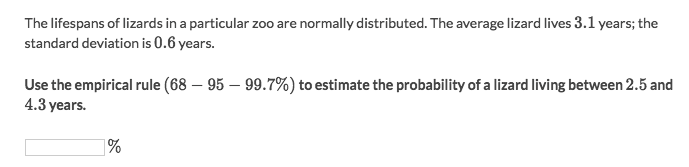

#  Empirical Rule 「68-95-99.7 Rule」

> This rule **ONLY** applies to `Normal Distribution`.

It's also called the **`68-95-99.7% rule`**, because for a `normal distribution`:
- ≈68% of the data falls within 1 standard deviation of the mean
- ≈95% of the data falls within 2 standard deviations of the mean
- ≈99.7% of the data falls within 3 standard deviations of the mean

### Example

Solve:
- According to the `z-score` of point 32.2, `(32.2-20.5)/3.9=3` which is `3 standard deviations` away from the mean
- So by looking at the `empirical rule graph`,  we get the percentage of `3𝜎` away from mean.
- Hence the percentage **above** that value is `0.15%`

### Example

Solve:
- According to the `z-score` formula, we get the two points' z-score are: `-1 & 2`
- By looking at empirical rule graph, the `-1𝜎 & 2𝜎` represents 16th percentile & 97.5th percentile.
- So subtract the overlays and we'll get `97.5% - 16% = 81.5%` 
