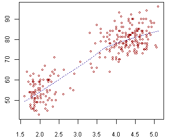
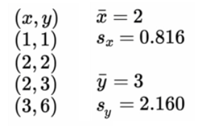
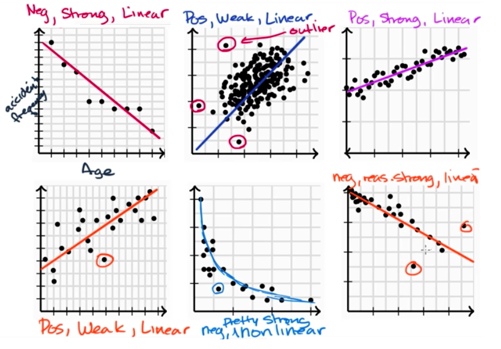
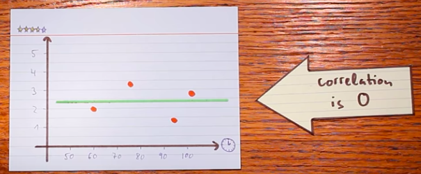
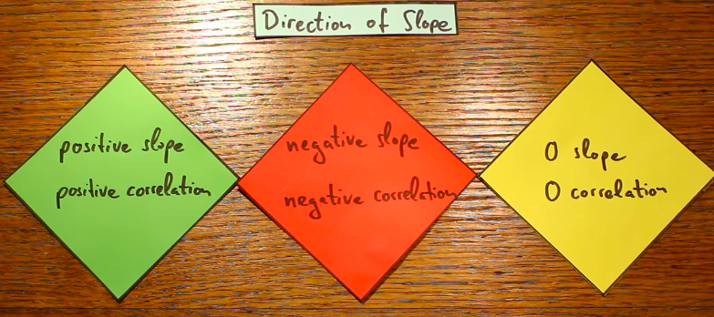
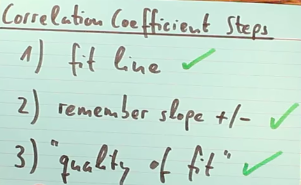
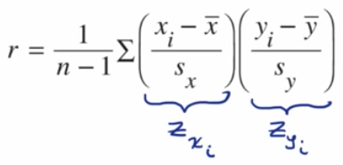

# Scatter Plot

Just to plot many **dots** on the X-Y plane.

## Linear & Non-linear Relationship

If you can fit **a** LINE through those points, it's **linear relationship**.
If not, then it's **non-linear**.

## Positive & Negative Relationship

If the scatterplot has a **linear relationship**:
- If the **slope** is positive, then it's **positive relationship**
- If the **slope** is negative, then it's **negative relationship**

## 「Bivariate relationship」Linearity, Strength and Direction

> `Bivariate` is just a fancy way to say: 
For analyzing each point in X-Y plane, we analyze x & y **SEPERATELY**. 
etc., at point `(2,3)`, including x-position is 2 and y-position 3, we analyze the x-values of all data-points, and then y-values of all data-points.

[Refer to Khan academy: Bivariate relationship linearity, strength and direction](https://www.khanacademy.org/math/ap-statistics/bivariate-data-ap/modal/v/bivariate-relationship-linearity-strength-and-direction)

## 「Correlation Coefficient」

> The `Correlation`is the **SLOPE**, and the `coefficient` of it is kind of **adjustment** to describe how well the slope fits the data.
It's also kind of like a **"Unit SLOPE"** of the estimated `Regression Line`.

[Refer to youtube: The Correlation Coefficient - Explained in Three Steps](https://www.youtube.com/watch?v=ugd4k3dC_8Y)
[Refer to Khan academy: Correlation coefficient intuition](https://www.khanacademy.org/math/ap-statistics/bivariate-data-ap/modal/v/correlation-coefficient-intuition-examples)
[Refer to Khan academy: Calculating correlation coefficient r](https://www.khanacademy.org/math/ap-statistics/bivariate-data-ap/modal/v/calculating-correlation-coefficient-r)

`Correlation Coefficient` is represented as letter `r`. 
The interval of `r` is `-1 ≤ r ≤ 1`:
- `r=1` when the line fits **ALL** data points. The better the line fits the data points, the `r` is closer to 1 or -1.
- `r=0` when there's NO **correlation** or `linear relationship`. The "worse" the line fits data, the `r` is closer is closer 0.

### Find out the Correlation Coefficient

Formula:

