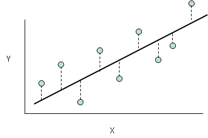
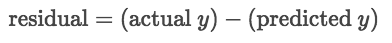
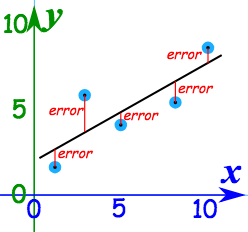
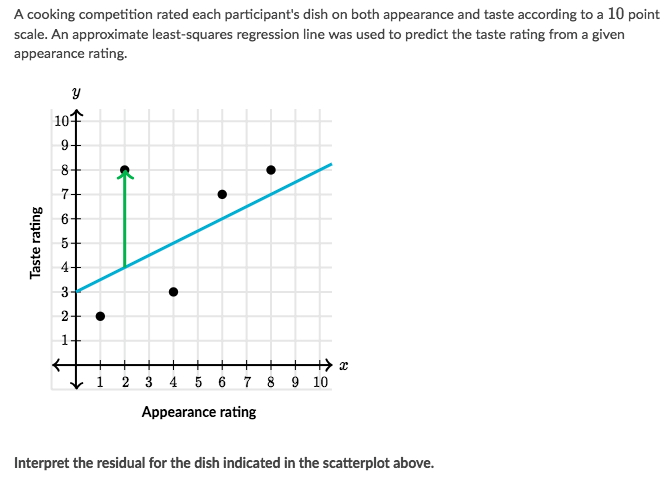
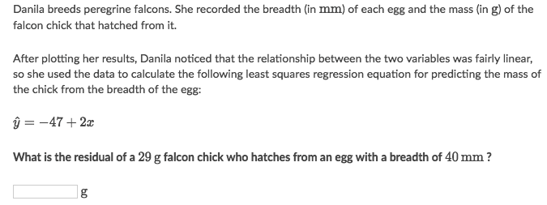
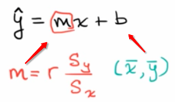
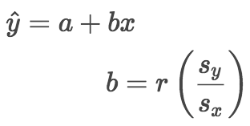
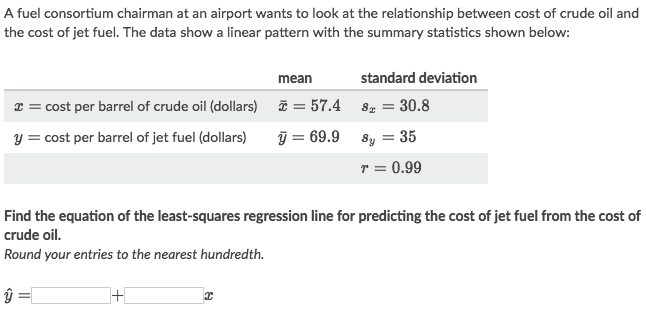
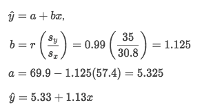

#  ❖ Least-square Regression

> _Least-square Regression_ is one way of calculating _Linear Regression_. 
Most regressions' calculations are done by **computer**, but we want to do that by hand to have better understanding.

What is Linear Regression?
Trying to fit a line as closely as possible, and as many of points as possible, is called "Linear Regression".

[Refer to Khan academy: Introduction to residuals and least-squares regression](https://www.khanacademy.org/math/ap-statistics/bivariate-data-ap/modal/v/regression-residual-intro)

## 「Residuals」

> Residuals are **errors**. More specifically, they are the differences between the actual value of the response variable and the value predicted by the least squares regression line.

At a certain X-position, the value of _residual_ is the **VERTICAL DISTANCE** from the actual value to the Regression Line.

- When the `residual` is **positive**, the **actual point** is **ABOVE** the `regression line`,
- When the `residual` is **negative**, the **actual point** is **BELOW** the `regression line`.

> The way that we calculate the `Regression Line` with `Least Square` method, is to **MINIMIZE** the **square of residuals**.

### Example

Solve:
- This dish's actual taste rating was 4 points higher than predicted **based on its appearance**

### Example

Solve:
- Recognize the **VARIABLES**: Y -> mass, X -> breadth
- So the expected mass is `-47 + 2*40 = 33`
- Since the observed mass is 29,
- So `residual = observed - expected = 29 - 33 = -4`

## Calculate the equation of 「Least-square line」

[`▶ Practice at Khan academy: Calculating the equation of the least-squares line`](https://www.khanacademy.org/math/ap-statistics/bivariate-data-ap/modal/e/calculating-equation-least-squares)

[Refer to Khan academy: Calculating the equation of a regression line](https://www.khanacademy.org/math/ap-statistics/bivariate-data-ap/modal/v/calculating-the-equation-of-a-regression-line)

Formula of Regression line:

1. As we said the `Correlation Coefficient r` is kind like the **`Unit Slope`** which is between `-1 to 1`, so we have to apply the `unit slope` in real case by multiply `r` with the **ratio** of Standard Deviation of `y` & `x`, which is `Sy/Sx`.
2. A "must go through point" is the **MEAN** of the dataset, which is: `(Ẋ, Ẏ)`. At the mean, the `residual = actual`

With two informations above, we can easily calculate out the estimated Regression Line.

### 「Slope」 of Regression line

### 「Intercept」 of Regression line

### Example

Solve:

