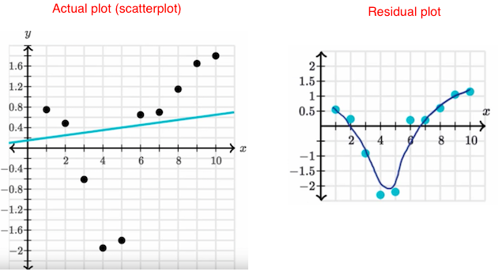

# Residual Plot

[Refer to Khan academy: Residual plots](https://www.khanacademy.org/math/ap-statistics/bivariate-data-ap/modal/v/residual-plots)

Linear model Residual plot:

Non-linear model Residual plot:

