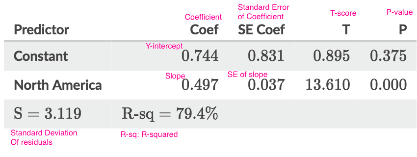

# Output of Least-square Regression

[Refer to Khan academy: Using least squares regression output](https://www.khanacademy.org/math/ap-statistics/bivariate-data-ap/modal/v/using-least-squares-regression-output)
[Refer to Khan academy: Confidence interval for the slope of a regression line](https://www.khanacademy.org/math/ap-statistics/inference-slope-linear-regression/modal/v/confidence-interval-slope)

Prerequisite:
- Sampling Distribution
- Confidence Interval
- Hypothesis Test

