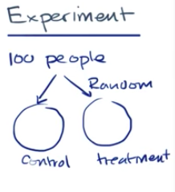
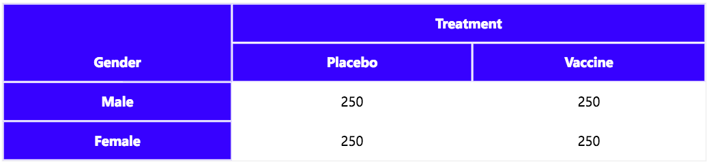
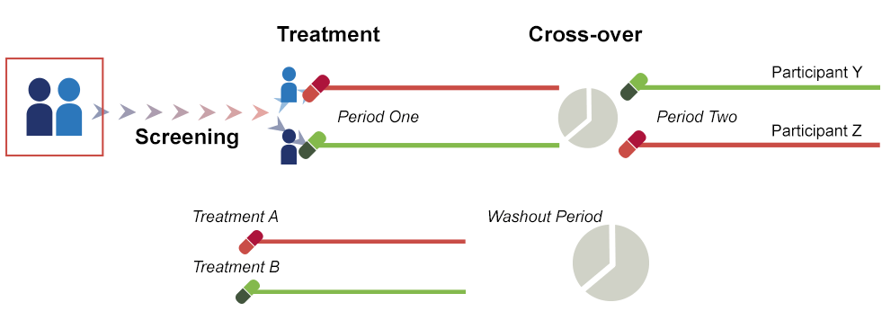
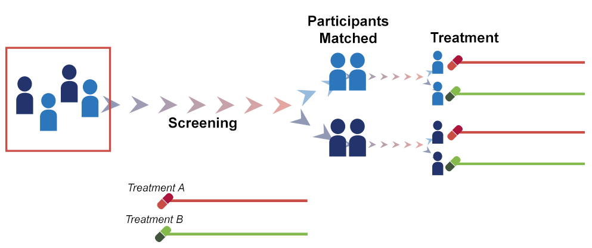

#  ❖ Experiment Study

RANDOMLY divide samples to a Control Group and a Treatment Group, and compare 2 groups of which one is AFFECTED and another one NOT AFFECTED.

[Refer to Khan academy: Introduction to experiment design](https://www.khanacademy.org/math/ap-statistics/gathering-data-ap/modal/v/introduction-to-experiment-design)
[Refer to EUPATI: Clinical trial designs](https://www.eupati.eu/clinical-development-and-trials/clinical-trial-designs/)

The **purpose** is to build a **CAUSAL RELATIONSHIP**, which might tell you one even can cause another event, which `observational study` **can't** tell.

The key is to divide two groups **randomly**, so that you will know how the affection really makes impact.

Two groups:
- Control group is the group **without** taking affects.
- Treatment group is the one will be having affects on.

## How to conduct a good Experiement

There're a few keys to conduct a good experiment:
- **Randomly** divide samples to two groups, to eliminate biases.
- It should be a **BLIND EXPERIMENT**, which all people don't know which group they're in.

## 「Placebo Effect」

`Placebo` means "fake medicine", which made by sugar.
In drug testing and medical research, it's a very common way to test how **mentality** will affect the patient.

For conducting a medicine experiment, we randomly separate people to two groups:
- Control group: people will receive **placebo**.
- Treatment group: people will receive **real medicine**.

## 「Blind Experiment」 & 「Double Blind Experiment」

- `Blind experiment`: All the observed people don't know which group they're in.
- `Double Blind Experiment`: Not only the observed people, but even the conductors/administers don't know which is which.
- `Triple Blind Experiment`: Even the people who analyze the data don't know which group they're analyzing.

It's a great way to avoid **BIAS**.

## Improving 「Randomly Grouping」

Some times **complete randomness** will make things **uneven**, which raise the bias in experiment.
etc., there're more women in one group and less in another, that affects much in the result; there're more young people in one group, that affects much as well.

So for helping to adjust this situation well, we want to introduce some improvement design for **group strategy**:
- `Block Design`
- `Cross Over Design`
- `Matched Pairs Design`: It is a special case of a **randomized** `block design`.

### Randomized 「Block Design」

With a randomized block design, the experimenter divides subjects into subgroups called blocks, such that the variability within blocks is less than the variability between blocks. Then, subjects within each block are randomly assigned to treatment conditions. Compared to a completely randomized design, this design reduces variability within treatment conditions and potential confounding, producing a better estimate of treatment effects.

### 「Cross Over」 Design

It's simply just to "switch group", which after a period of time after the experiment to do the **second experiment**, that let the same people in Control Group switch to Experiment Group, and the other people switch as well.

> Khan academy made the **wrong** video named "matched pairs design" which is actually "Crossover Design".
[Refer to Khan academy: Crossover Design ~(Matched pairs experiment design)~](https://www.khanacademy.org/math/ap-statistics/gathering-data-ap/modal/v/matched-pairs-experiment-design)

### 「Matched Pairs」 Design

In the matched-pair design, participants are first matched in pairs according to certain characteristics. Then, each member of a pair is randomly assigned to one of the two different study subgroups. This allows comparison between similar study participants who undergo different study procedures.

## 「Replication」

> "A very important idea, in science in general... Other people should be able to **replicate** and reinforce this experiment and hopefully get the consistent result" - Sal Khan
