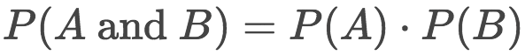
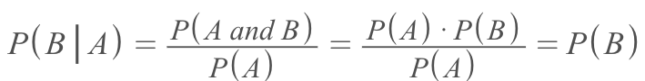
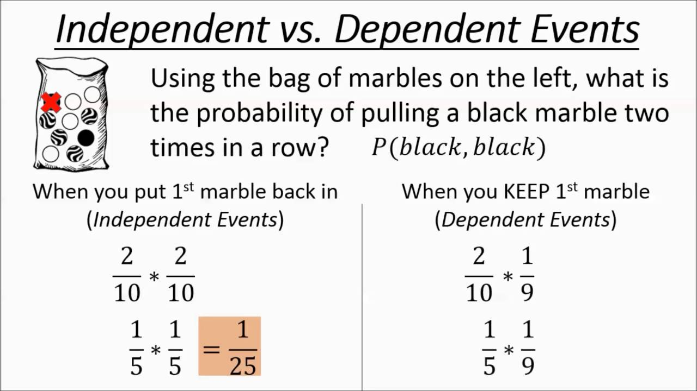
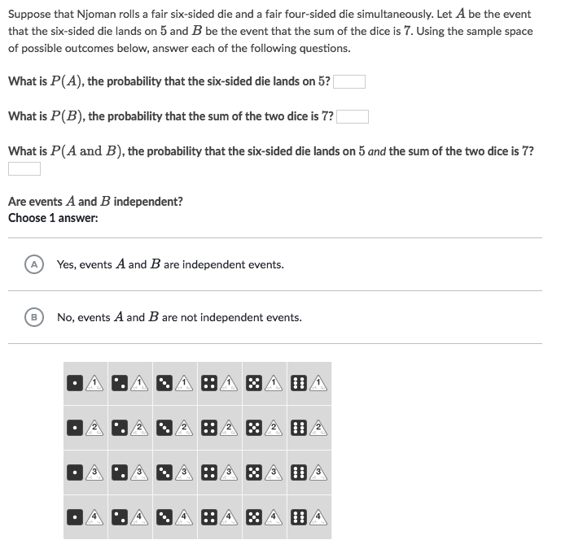
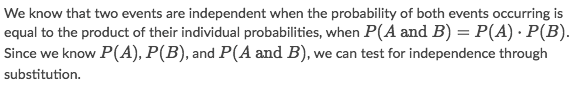
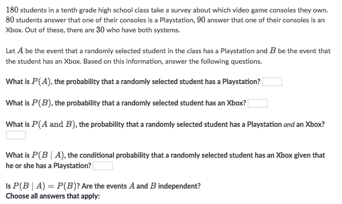
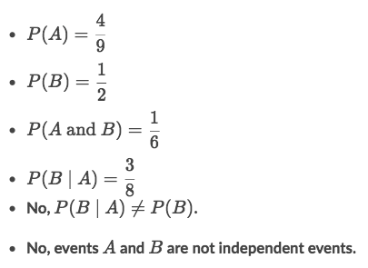

# Dependent Probability

> _Dependent probability_ means the result of second event will change because of what happened first.

[Refer to Khan academy: Dependent probability introduction](https://www.khanacademy.org/math/ap-statistics/probability-ap/modal/v/introduction-to-dependent-probability)

**Two events are INDEPENDENT to each other when**:

**Furthermore, with concept of Conditional Probability, two events are INDEPENDENT when:**

## `Dependent Probability` & `Independent Probability`

[`▶ Practice on Khan academy: Dependent and independent events`](https://www.khanacademy.org/math/statistics-probability/probability-library/conditional-probability-independence/e/identifying-dependent-and-independent-events)

### Example

Solve:
- P(A) = 4/24
- P(B) = 4/24
- P(A & B) = 1/24
- They're not independent because:

### Example

Solve:

