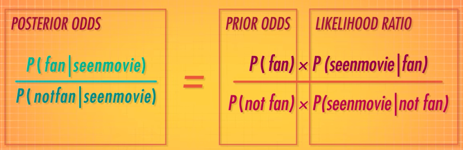
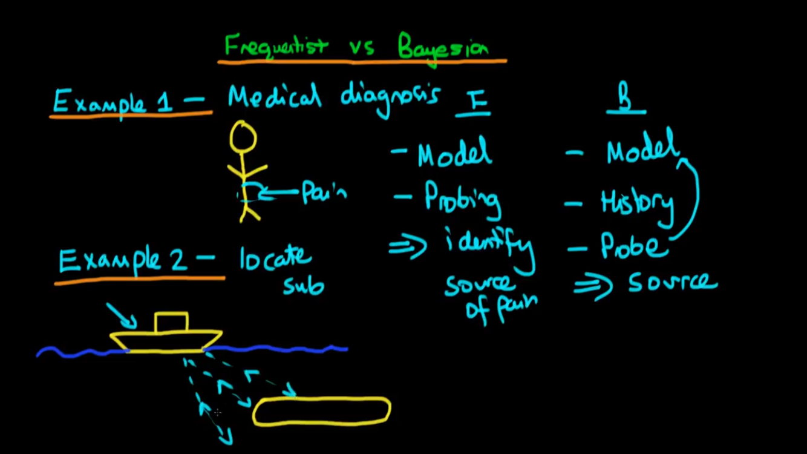
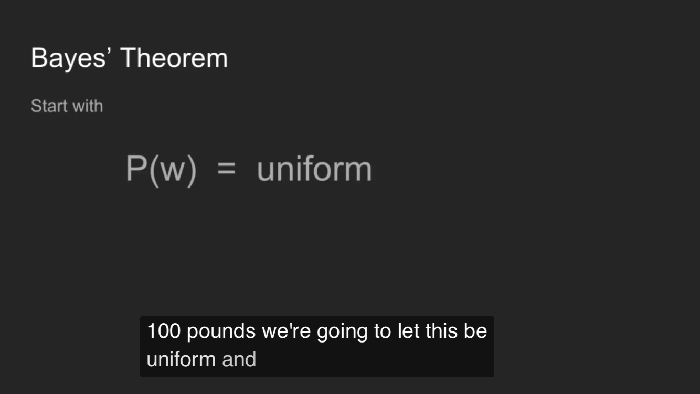
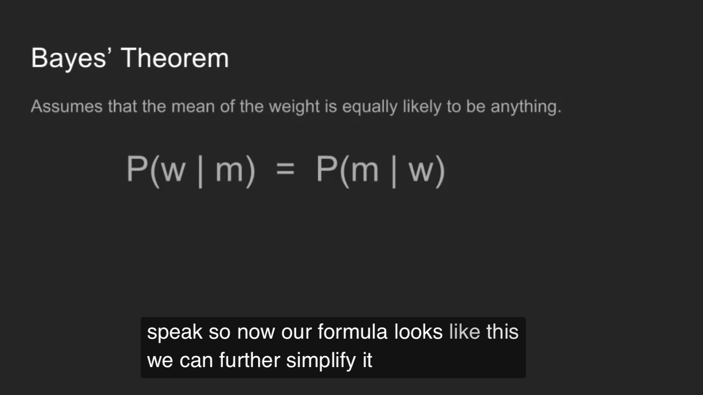

#  ❖ Bayesian Statistics [DRAFT]

[Refer to youtube: You know I’m all about that Bayes: Crash Course Statistics #24](https://www.youtube.com/watch?v=9TDjifpGj-k)
[Refer to youtube: Bayes in science and everyday life: Crash Course Statistics #25](https://www.youtube.com/watch?v=51bLRF02b4w)

