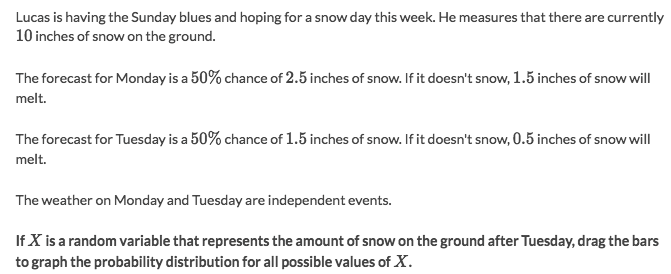
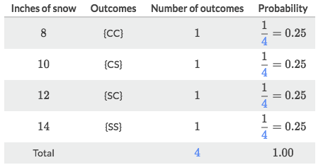
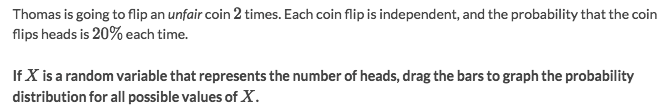
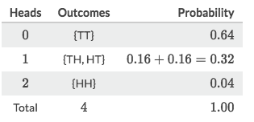

#  ❖ What is 「Random Variable」

> Instead of analyzing a **measured** distribution with explicit data, we're to **abstract** those analysis methods with **uncertain** data.
It's like **abstracting `arithmetic` to `algebra`**.

[Refer to Khan academy: Random variables](https://www.khanacademy.org/math/statistics-probability/random-variables-stats-library/modal/v/random-variables)
[`▶︎ Jump over to Khan academy for practice: Constructing probability distributions`](https://www.khanacademy.org/math/statistics-probability/random-variables-stats-library/modal/e/constructing-probability-distributions)

`Random Variables` are just like the **unknowns** in algebra. Except it's slightly different in Statistics.

Remember that: Studying `Random Variables` is just like studying `Algebra` over Arithmetic.

> More precisely, `Random variables` are **neither random nor variables.** (Try to google that)

Random Variables are denoted by capital letters: **_X, Y, Z_**

### Example

Solve:

### Example

Solve:

## Types of 「Random Variable」

[Refer to Khan academy: Discrete and continuous random variables](https://www.khanacademy.org/math/statistics-probability/random-variables-stats-library/modal/v/discrete-and-continuous-random-variables)

- Discrete Random Variable
    - Binomial Random Variable
    - Geometric Random Variable
- Continuous Random Variable

"Discrete" literally means "Distinct" or "Separate" values.

The most useful one for real life is the `Discrete Distribution`, and we're gonna talk about it mostly.

