#  ❖ 「Relative Frequency」 for Expected Value

[`▶︎ Practice at Khan academy: Making decisions with expected values`](https://www.khanacademy.org/math/statistics-probability/random-variables-stats-library/modal/e/making-decisions-with-expected-values)

`⦿ Mindset: It's better to count 1 by 1 rather than trying to apply formulas.`

There're 2 ways to calculate the `Expected Value`:
- `E(X) = ∑ Probability · value`
- `E(X) = ∑ Relative Frequency · value`

`Relative Frequency` means **How often something happens divided by all outcomes.**

Depends on the case we're analyzing, we can choose either way to calculate expected value.

**All the Relative Frequencies add up to 1.**

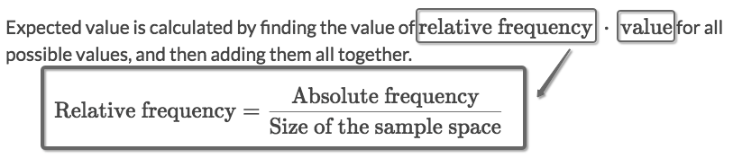

## 「Absolute Frequency」

[`▶︎ Jump back to previous note on: Permutation & Combination`](https://github.com/solomonxie/solomonxie.github.io/issues/50#issuecomment-409875416)

It also means the `Relevant Outcomes`, which is calculation of "n choose k" combinations.

## 「Sample Size」

[`▶︎ Jump back to previous note on: Intro to Probability`](https://github.com/solomonxie/solomonxie.github.io/issues/44#issuecomment-372205396)

It literally means the `Total Outcomes`.

For a `Flip Coin problem` (`Yes-No problem`), the **total outcomes** is `2^trails`, which means `2 * 2 * 2 ....`.
etc., the total outcomes of "flipping a coin 5 times" is `2⁵ = 32`.

## Calculate 「Probabilities for Expected Value」

[`▶︎ Practice at Khan academy: Expected value with calculated probabilities`](https://www.khanacademy.org/math/statistics-probability/random-variables-stats-library/modal/e/expected-value-with-calculated-probabilities)

### Example

Solve:
- This is a typical `Flipping Coin problem`.
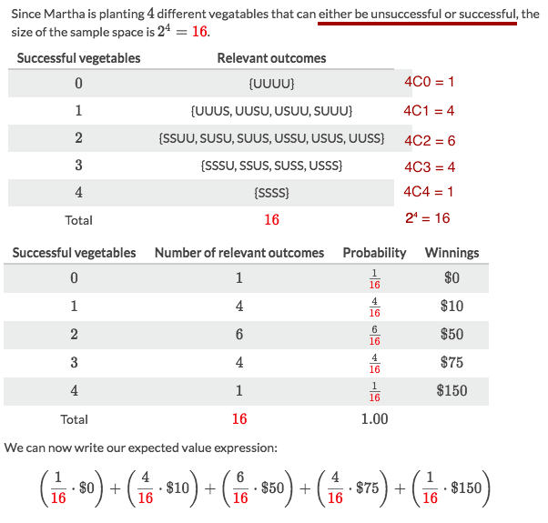

### Example

Solve:
- The most tricky part is how to calculate the probability of his each position.
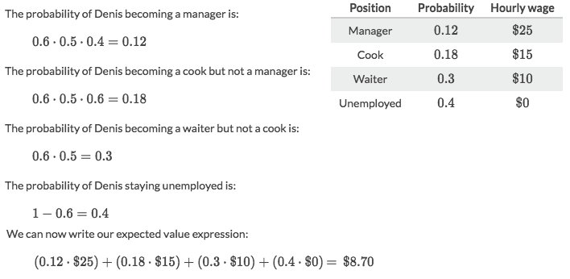

### Example
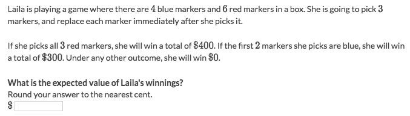
Solve:
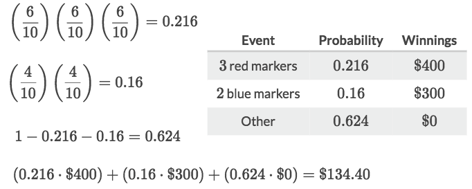

### Example
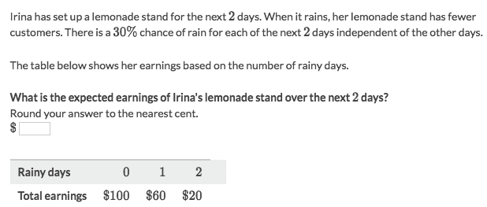
Solve:
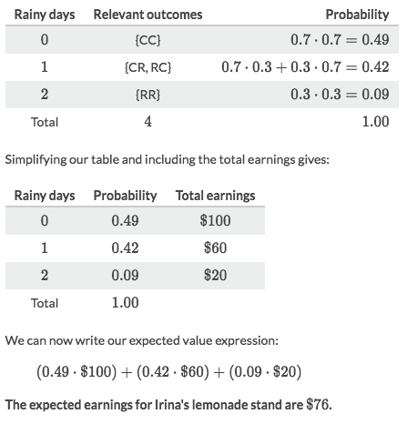

## Getting data from 「Expected Value」

[Refer to Khan academy: Getting data from expected value](https://www.khanacademy.org/math/statistics-probability/random-variables-stats-library/modal/v/empirical-data-expected-value)
[`▶︎ Practice at Khan academy: Expected value with empirical probabilities`](https://www.khanacademy.org/math/statistics-probability/random-variables-stats-library/modal/e/expected-value-with-empirical-probabilities)

### Example
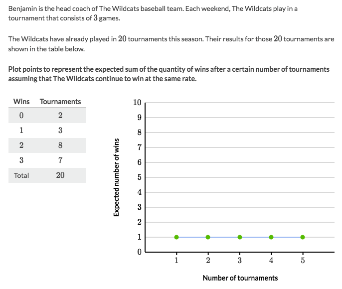
Solve:
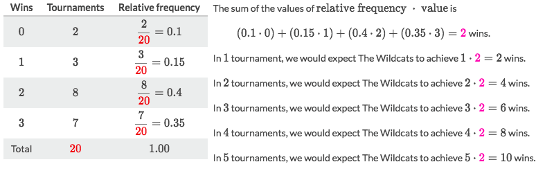

### Example
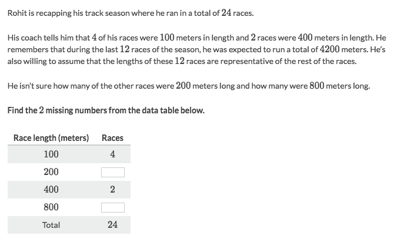
Solve:
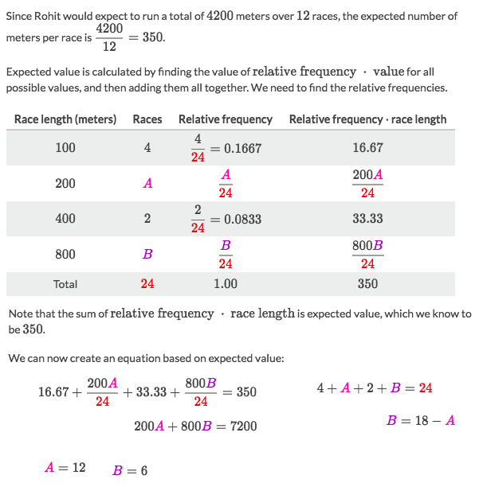

