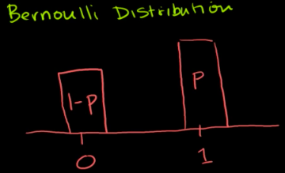
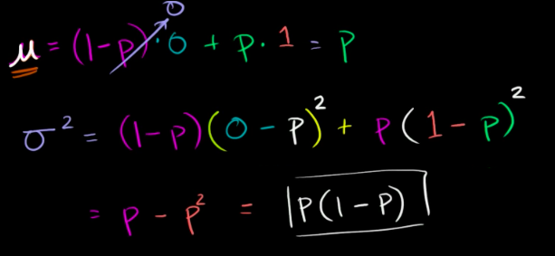
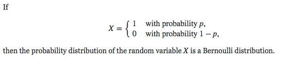

# Bernoulli Distribution

> It is the `discrete probability distribution` of a random variable which takes the value `1` with probability p and the value `0` with probability `q=1-p`, that is, the probability distribution of any single experiment that asks a `yes–no questio`n; 
the question results in a `boolean-valued outcome`, a single bit of information whose value is `success/yes/true/one` with probability `p` and `failure/no/false/zero` with probability `q`.

[Refer to wiki: Bernoulli Distribution](https://www.wikiwand.com/en/Bernoulli_distribution)
[Refer to Khan academy: Bernoulli distribution mean and variance formulas](https://www.khanacademy.org/math/statistics-probability/random-variables-stats-library/modal/v/bernoulli-distribution-mean-and-variance-formulas)

## 「Mean & Variance」of Bernoulli Distribution

## 「Bernoulli Distribution」 vs. 「Binomial Distribution」

[Refer to stackexchange: What is the difference and relationship between the binomial and Bernoulli distributions?](https://math.stackexchange.com/questions/838107/what-is-the-difference-and-relationship-between-the-binomial-and-bernoulli-distr/838122)

All Bernoulli distributions are binomial distributions, but most binomial distributions are not Bernoulli distributions.

