#  ❖ Geometric Random Variables

[Refer to wiki: Geometric distribution](https://www.wikiwand.com/en/Geometric_distribution)
[Refer to Khan academy: Geometric random variables introduction](https://www.khanacademy.org/math/ap-statistics/random-variables-ap/modal/v/geometric-random-variables-introduction)

## 「Geometric Random Variable」 vs. 「Binomial Random Variable」

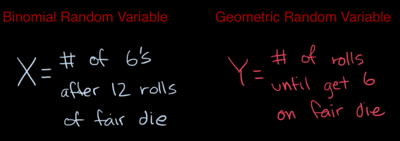

- A `binomial setting` has a set number of trials, and the variable in question is the number of successes that occur in those trials.
- A `geometric setting` DOES NOT have a set number of trials, and the variable in question is the number of trials it takes to get the first success.

In both settings, the trials are independent and the probability of success remains the same on each trial.

The only difference between `Geometric R.V.` and `Binomial R.V.` is that, 
**The Geometric R.V. DOES NOT have a certain number of trails.**

Requirements of Geometric R.V.:
- `p`: Same probability p on each trail.
- `Yes-no question`: Each trail's outcome is either success or failure.
- `Independent`: Each trail is independent to each other.

## Understanding「Geometric Probability」

The geometric distribution gives the probability that the first occurrence of success requires k independent trials, each with success probability p.

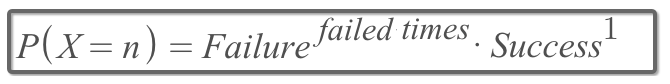

If it's asking for `Number of Trails`, then the number `Trails = failures + success = (n-1) + 1`.
If it's asking for `Number of failures`, then the number `Trails = Failures+1 = n+1`.
**And that's why the formula is slightly different.**

Assume `p` is the probability of success on each trail, `n` is the number of trails or failures:
- `Number of Trials` until the first success:
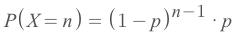
- `Number of Failures` until the first success:
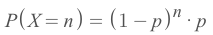

### Example
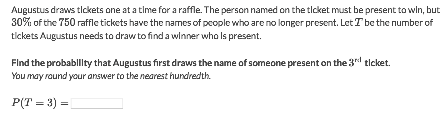
Solve:
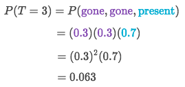

## 「Mean & Variance」 of Geometric Probability

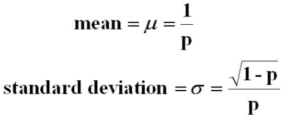

## 「Cumulative Geometric Probability」

We know how to calculate Geometric Probability at each value, but `Cumulative G.P.` would be bit tricky.

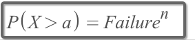

**The formula literally means: FAIL a TIMES IN A ROW.**

This formula is good for `X>a`, and with a bit twist you can get most out of it.
etc., 
- `P(X≥4)` is the same with `P(X>3)`
- `P(X≤5)` is the same with `1 - P(X>5)`
- `P(X<7)` is the same with `1 - P(X>6)`

### Example
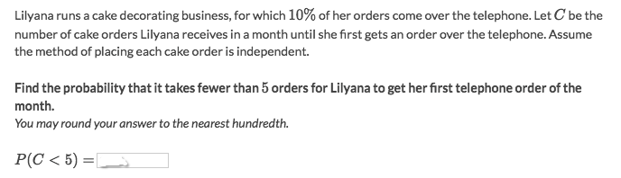
Solve:
- The easiest way is to apply the cumulative geometric probability formula:
- `P(X<5) = 1 - P(X>4) = 1 - Failure⁴ = 1-0.9^4 = 0.34`
- Another way is to calculate each item in the sequence:
`P(C≤4) = P(C=1) + P(C=2) + P(C=3) + P(C=4)`
- which we expand it to:
`P(C≤4) = 0.9⁰*0.1 + 0.9*0.1 + 0.9²*0.1 + 0.9³*0.1`
- We could easily recognize it as a standard `Geometric Series`, so we can apply the formula:
`P(C≤4) = 0.1 * (1-0.9⁴) / (1-0.9) = 0.34`

### Example
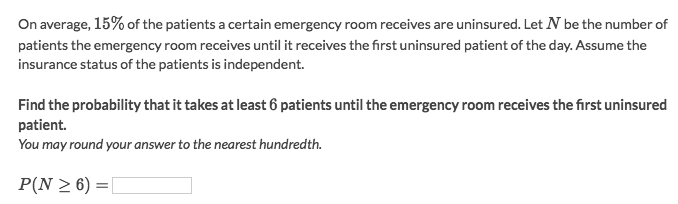
Solve:
- It's the same as "the probability of 5 failures in a row."
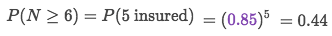

### Example
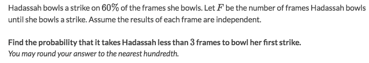
Solve:
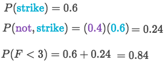

