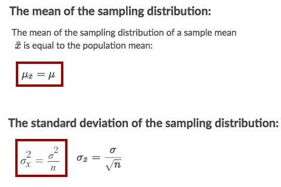
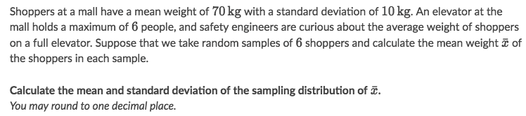
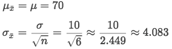
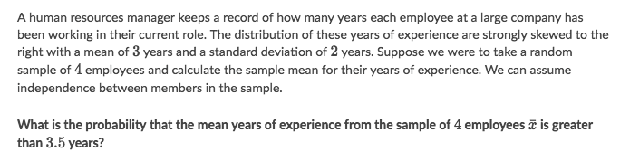

#  ❖ Sample Mean

> Also called "Sampling distribution of Sample Mean".

## 「Mean & Variance」 of Sample Means

### Example

Solve:

## 「Probability of sample mean」 exceeding a value

[Refer to Khan academy: Example: Probability of sample mean exceeding a value](https://www.khanacademy.org/math/statistics-probability/sampling-distributions-library/modal/v/sampling-distribution-example-problem)

### Example

Solve:
- The Sample Size is too small, which is hard to make the Sample Distribution normal.
- It didn't tell the Parent Distribution's shape, so there's no way to tell if the Sample Distribution can match the parent shape as normal shape.

