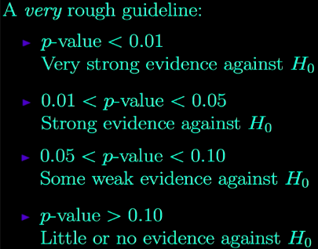
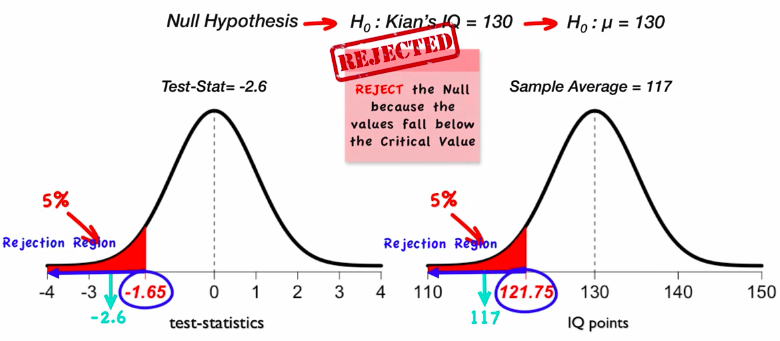
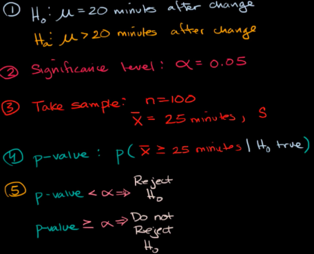
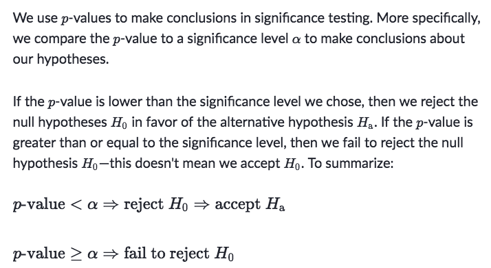
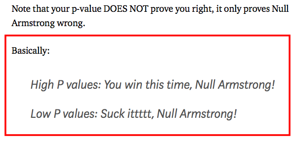

#  ❖ Significance Testing

> Also called the `Null Hypothesis Significance Testing`.

We design a `Significance Test` to evaluate the strength of the evidence against some **null hypothesis**. 
The **alternative hypothesis**  is the claim we are trying to find evidence in favor of.

The _Significance Test_ involves with these concepts:
- _Null hypothesis_ & _Alternative hypothesis_
- _p-value_
- _Significance Level_
- _Type I & Type II Error_
- _Power_

## 「Significance Level」 ⍺, alpha, threshold

For making a "judge" on wether the hypothesis stands or fails, we need a standard or threshold to judge it, which we called the `Significance Level`, or the `Cutoff`, denoted `⍺` (alpha).

There are a few common sets on the _significance level_:
- \<1%: Very strong evidence against our claim.
- \<5%: Strong evidence against our claim.
- \<10%: Weak evidence against our claim.
- \>10%: Little or no evidence against our claim.

### 「Critical Values」 & 「Rejection Regions」

[Refer to youtube: Hypothesis Testing 4: critical values and rejection regions (one sample t test)](https://www.youtube.com/watch?v=BdeuCflLPQI)

## 「p-value」
**p-value tells the MAXIMUM of the "truth" takes part in your story.**

[`▶︎ Jump back to previous note: p-value`](https://github.com/solomonxie/solomonxie.github.io/issues/50#issuecomment-419618965)

## Steps of 「Significance Testing」

[Refer to article on Khan academy: Using P-values to make conclusions](https://www.khanacademy.org/math/statistics-probability/significance-tests-one-sample/modal/a/p-value-conclusions)

## Use 「P-value」 to make conclusion

## Use 「Confidence interval」 to make conclusion

[Refer to Khan academy: Confidence interval for hypothesis test for difference in proportions](https://www.khanacademy.org/math/ap-statistics/two-sample-inference/modal/v/confidence-interval-for-hypothesis-test-for-difference-in-proportions)

[`▶︎ Jump back to previous note on: Confidence Interval`](https://github.com/solomonxie/solomonxie.github.io/issues/50#issuecomment-418060445)
[`▶︎ Jump back to previous note on: Significance Test`](https://github.com/solomonxie/solomonxie.github.io/issues/50#issuecomment-419806342)

In a two-sided test, the null hypothesis says there is no difference between the two proportions. In other words, the null hypothesis says that the difference between the two proportions is 0. 

We can use a confidence interval instead of a P-value for two-sided tests as long as the confidence level and significance level **add up to 100%**.

For example, 

That being said, if the `Confidence Interval` **DOES NOT** overlap with the _Null Hypothesis Difference_, 0 in this case, then the "true difference" will fall into the Significance Level, which should be reject. 

Since `Confidence Level + Significance Level = 100%`:
- CI exlcudes 0 ▶ Smaller interval & larger significance ▶ Significance level > P-value ▶ Not reject
- CI includes 0 ▶ Larger interval & smaller significance ▶ Significance level < P-value ▶ Reject

### Example

Solve:
- Since the _null hypothesis difference_ is 0 (H₀: pe-pw=0),
- so we're to examine if the _confidence interval_ contains the "assumed difference" 0
- Surely the interval `0.09±0.086` contains 0, 
- therefore the hypothesis should NOT be rejected.

