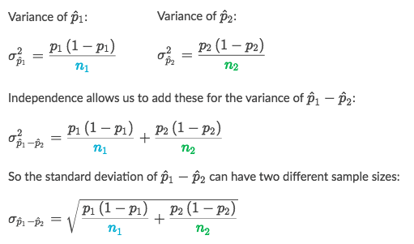

# Inference for comparison

> `Two-sample inference for the difference between groups`

## Conditions for 「Two-sample Z」

"same-o same-o".

The conditions we need for inference on two proportions are:
- **Random**:
The data need to come from **TWO** random samples or **TWO** groups in a randomized experiment.
- **Normal**:
The normal condition says that we need at least 10 successes and 10 failures **in each group**. 
- **Independent**:
Individual observations in each group and the groups themselves need to be independent. If sampling without replacement, each sample size shouldn't be more than 10% of its population.

This interval **doesn't require equal sample sizes** from each population. The formulas we use allow for different sample sizes.

