# 「Confidence Interval」 for Difference

[Refer to Khan academy: Confidence intervals for the difference between two proportions](https://www.khanacademy.org/math/ap-statistics/two-sample-inference/modal/v/confidence-intervals-for-the-difference-between-two-proportions)

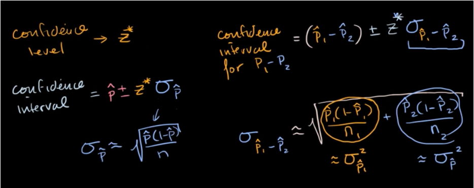

## CI for 「Difference on Proportions」

[`▶ Jump back to previous note on: Z-intervals`](https://github.com/solomonxie/solomonxie.github.io/issues/50#issuecomment-418641425)

### Formula

We can make a confidence interval for the difference of two proportions like this:

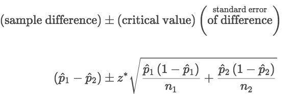

### Example
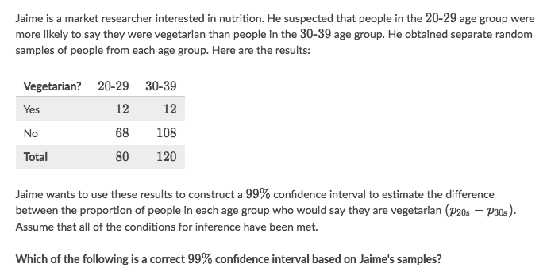
Solve:
- Get Z-value from the 99% of the Confidence Level by assume `μ=0 & 𝜎=1`
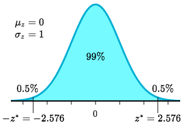
- Input `μ=0,  𝜎=1,  X=(1-0.99)/2=0.05` to a Z-score calculator, and get `Z* = 2.576`
- Determining the standard error:
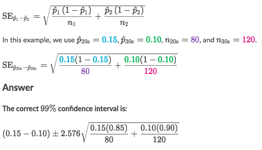

### Example
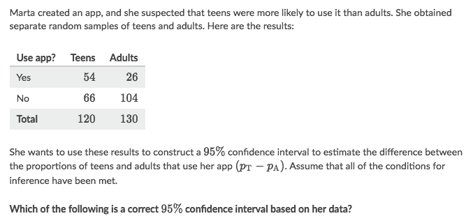
Solve:
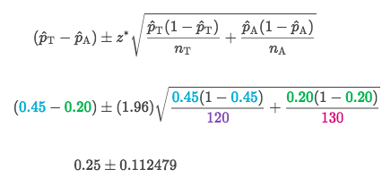

## CI for 「Difference on Means」

[`▶ Jump back to previous note on: T-intervals`](https://github.com/solomonxie/solomonxie.github.io/issues/50#issuecomment-418987783)

[Refer to Khan academy: Constructing t interval for difference of means](https://www.khanacademy.org/math/ap-statistics/two-sample-inference/modal/v/constructing-t-interval-for-difference-of-means)

### Formula
We can make a confidence interval for the difference of two means like this:
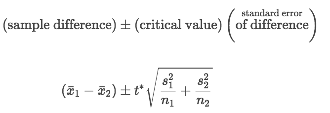

### Example
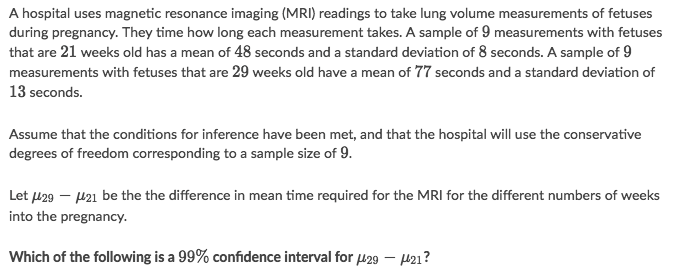
Solve:
- Rewrite informations:
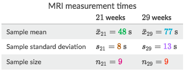
- Calculate `t*` value, input confidence level and degree of freedom to a calculator, to get t=3.355:
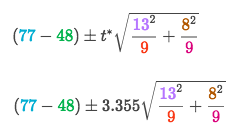

