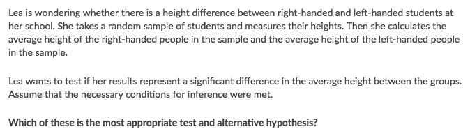
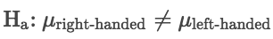
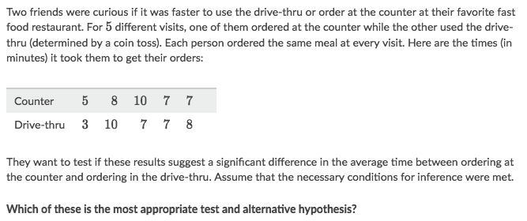
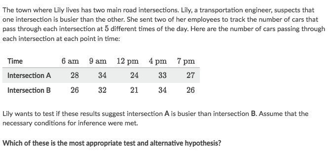

# 「Paired T Test」vs. 「Two-sample T Test」

[Refer to Khan academy: Example of hypotheses for paired and two-sample t tests](https://www.khanacademy.org/math/ap-statistics/two-sample-inference/modal/v/example-of-hypotheses-for-paired-and-2-sample-t-tests)

Consider the design of the study:
- Use a **paired test** if the study paired subjects in some way, or if the study compares two measurements on each subject.
- Use a **two-sample test** if the data were produced from two independent groups.

### Example

Solve:
- Each one in the sample is **either** left-handed or right-handed, so they're in different groups, which tells us we're gonna use `Two-sample Test` in this case
- It's asking for `Alternative hypothesis`, so it's:

### Example

Solve:
- Since their choice are "interchangeable", so they're **DEPENDENT**, and we're to use Paired Test

### Example

Solve:
- In this study, each time produced two measurements (number of cars in intersection A and number of cars in intersection B). Those measurements are almost certainly dependent in some way, so it wouldn't be appropriate to treat the intersection A measurements as being independent from the intersection B measurements. Since the measurements were paired for time, we should use a paired t test on the average difference between the measurements.
- The Alternative Hypothesis is:

