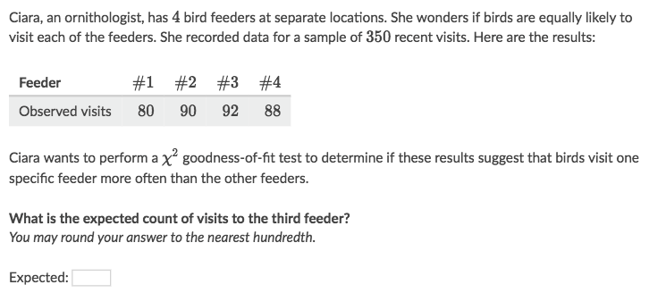
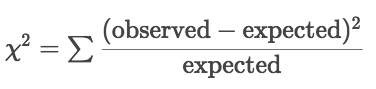
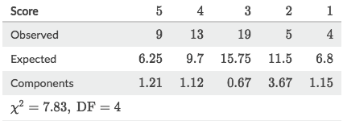
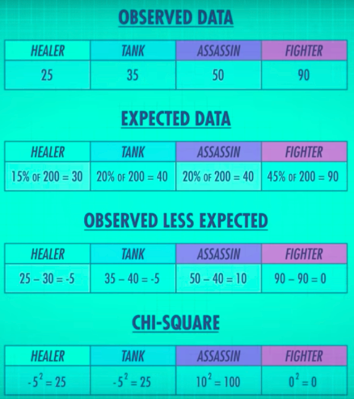
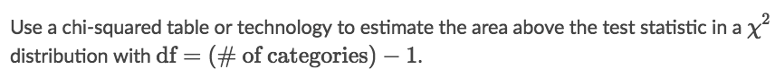
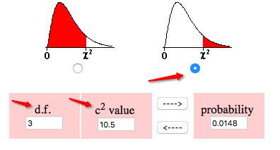
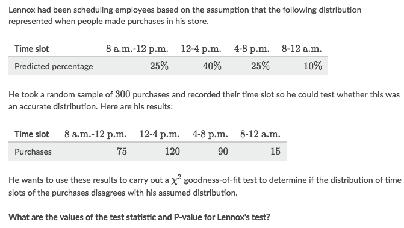
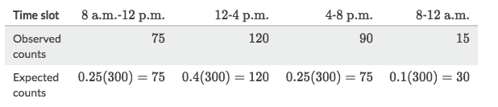
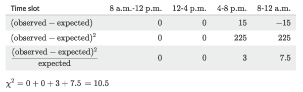
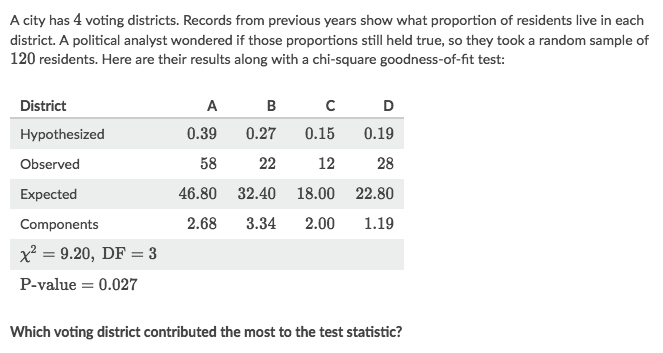

#  ❖ Chi-square 「Goodness-of-fit Test」

> Goodness-of-fit Test is good for testing a `One-row Frequency Table`.
The test shows how well certain proportions fit our sample, which only has ONE variable(row).

Steps:
- Choose a distribution (depends on the DF)
- Complete the Frequency Table with `Expected Counts` for each data
- Calculate the standardized `Chi-square value` 𝐗² according to the _Expected_ & _Observed_
- Use calculator to get the probability area `P-value` in the distribution according to 𝐗²

## 「Expected Frequencies」

Counting the **Expected Frequency** for data is the very first step and fundamental part of doing `Chi-square Test`.

The _expected frequencies_ can be either a **PRESET** or the **PROBABILITY** of the data.
The _expected frequencies_ are set as _Null Hypothesis_ in the test, 
and _Observed frequencies_ are the _Alternative Hypothesis_ against the null in the test.

> "For a χ² goodness-of-fit test, the null hypothesis is that the population distribution of the categorical variable in question matches some hypothesized distribution. We use that hypothesized distribution to calculate the expected counts for each value of the variable."

### Example

Solve:
- Since the _null hypothesis_ is 4 feeders has "equally likely" chance to feed the bird,
- so the supposed chance for each feeder would be `350/4 = 87.5`
- and 87.5 is the `Expected count` for each feeder.

## Test statistic 「𝐗²」

Chi-squared Test statistic Formula:

**To calculate 𝐗², we need to COMPLETE the _Frequency Table_, with both Expected and Observed values**:

Or you can see it as:

## 「P-value」

To calculate `P-value` we need the 𝐗² and _DF_:

For instance, it observes 3 prices for a fruit: prices of apple, orange, banana. Then there are **3 categories**, or **3 variables**. Therefore the _DF_ (Degree of freedom) is `(3-1)=2`

Get an [`online chi-squared calculator`](https://surfstat.anu.edu.au/surfstat-home/tables/chi.php), input the test statistic 𝐗² and DF, we'll get its P-value, like this:

### Example

Solve:
- Calculate the expected frequencies for each data:

- Compare Observed and expected, to get Chi-squared:

- Get a P-value calculator, input test statistic `𝐗²=10.5` and Degree of freedom `df= 4-1 = 3`:

## Making conclusions in a 「goodness-of-fit Test」

To overturn the __null hypothesis__, we just to compare the `P-value` with `Significance Level`.

But there's another type of conclusion we can make: which **component** contributes the most to the test statistic.
The way to do it, is simply look at each **component's** value, the bigger component the more it contributes.

### Example

Solve:
District B has the largest component because its observed count was farthest away from its expected count (relative to the expected count). So we can say that District B contributed the most to the  𝐗² test-statistic.
