#  ❖ Chi-squared Homogeneity Test

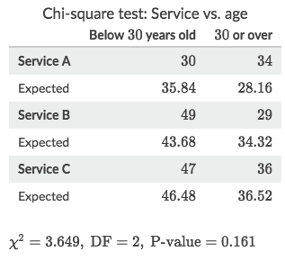

For the Chi-square homogeneity test we're gonna use this online calculator instead:
[`▶ Chi-Square Calculator`](https://www.di-mgt.com.au/chisquare-calculator.html)

## 「Expected counts」

- Intuitively, we just need to get the **Ratio** from the Total counts, and apply the ratio to the corresponding cell, as what we **expected**.
- In general, it can be calculated with this formula:
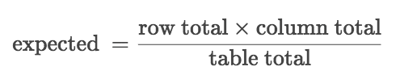

> The `Ratio` can either be `RowTotal / TableTotal` or `ColumnTotal / TableTotal`.

### Example
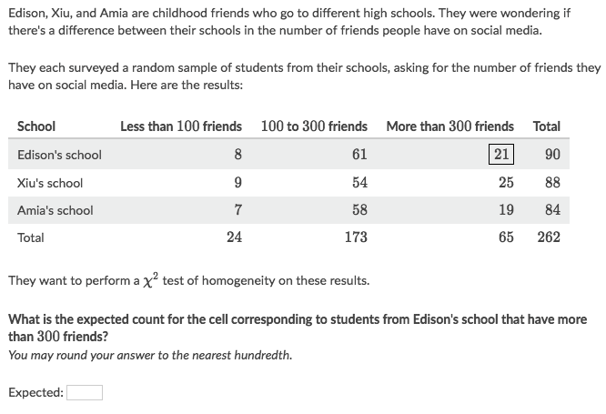
Solve:
- For the intuition, we just look at the Frequency Table, and get the _Ratio from total counts_, which is `65/262` in this case
- and apply the ratio to the Row total, which is `90` in this case, so it's `(65/262) * 90`
- Or we can just use the formula:
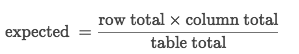
- which gets us:
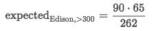

## Test statistic 「𝐗²」

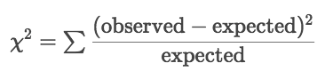

## 「P-value」

Degree of Freedom (DF) in the `Chi-square Homogeneity Test` would be:
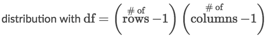

### Example
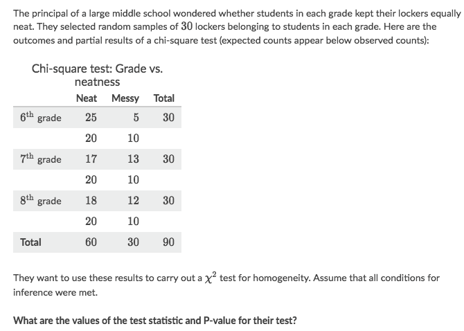
Solve:
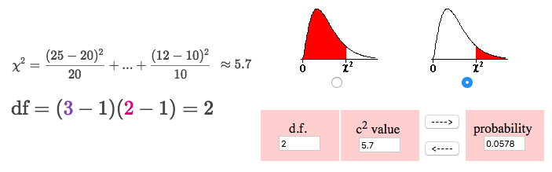

## Making conclusions in chi-square tests for 「two-way tables」

[Refer to the "hint" of each practice problem: Making conclusions in chi-square tests for two-way tables](https://www.khanacademy.org/math/ap-statistics/chi-square-tests/modal/e/conclusions-chi-square-tests-for-two-way-tables)

**Selecting appropriate hypotheses**
The chi-square statistic is such a versatile tool that we can use the exact same calculations to answer very different questions with it, depending on whether we draw our data from one sample or from independent samples or groups.

**Ⓐ Multiple independent Sample groups**
A chi-square test can help us when we want to know whether different populations or groups are alike with regards to the distribution of a variable. Our hypotheses would look something like this:
- H₀: The distribution of a variable is the **SAME** in each population or group.
- Ha: The distribution of a variable **DIFFERS** between some of the populations or groups.

We call this the chi-square test for `Homogeneity`

etc.,
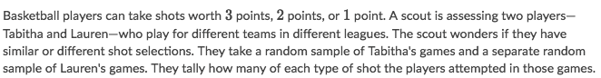

**Ⓑ One Sample group**
A chi-square test can help us see whether individuals from a sample who belong to a certain category are more likely than others in the sample to also belong to another category. Our hypotheses would look something like this:
- H₀: There is **NO** association between the two variables (they are independent).
- Ha: There **IS** an association between the two variables (they are not independent).

We call this the `chi-square test of association/independence`.

etc.,
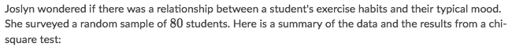

### Example
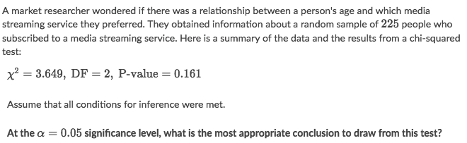
Solve:
- The people in this study came from one sample, so a test of independence/association is most appropriate. We could state the null and alternative hypotheses in this problem as:
    - Ho: There is no association between service and age.
    - Ha: There is an association between service and age.
- Since `𝐗² > ɑ`, so we should fail to reject Ho.
- So the conclusion is "This isn't enough evidence to say there is an association between service and age."
