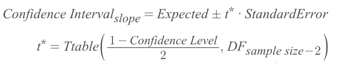
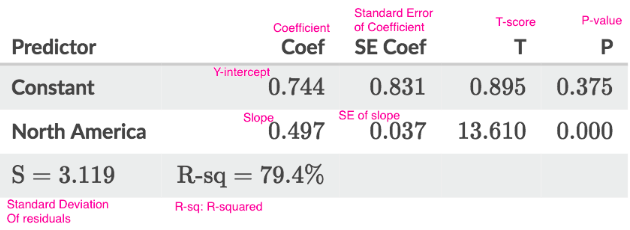
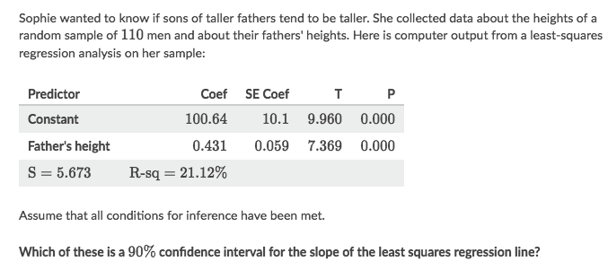
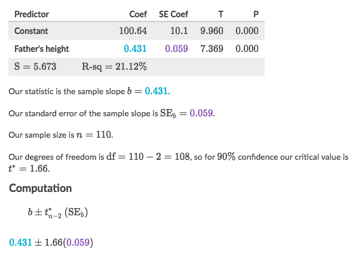
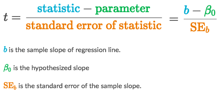
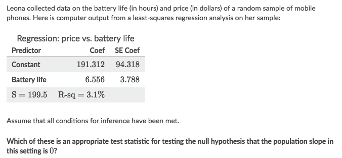
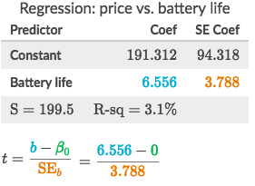
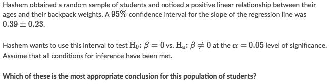
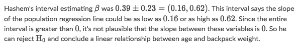

#  ❖ 「Inference」 on Linear Regression

## Conditions for 「inference on slope」 L-I-N-E-R

It can be concluded as `L-I-N-E-R`:
- `L`: Linear condition (Has linear relationship between x&y )
- `I`: Independent condition (Individual observations with replacement or 10% Rule)
- `N`: Normal condition (Sample size is at least 30)
- `E`: Equal variance condition
- `R`: Random condition

## 「Confidence interval」 for slope

Here's the formula for estimating the slope:

Notice: 
- We're using `T-interval` for estimating slope
- Degree of freedom(DF) becomes: `n-2`

### Interpreting the output of 「Inference of Slope」

### Example

Solve:
- Interpret the table.
- Collect essential values for calculating CI:
    - Expected value of slope
    - T-value
    - Sample size
- Calculate with formula

## 「T statistic」 for Slope

Here is the formula for T statistic for slope:

### Example

Solve:

## Use 「CI」 to make conclusions about 「slope」

[`▶︎ Jump back to previous note: Significance Testing`](https://github.com/solomonxie/solomonxie.github.io/issues/50#issuecomment-419806342)

Normally, we can make conclusion simply by comparing `P-value` with `Significance level`.

But there're cases ask us to make conclusion by comparing `Confidence level` with `Significance level`.
In that case, we can judge it by simply examine whether the **Confidence interval** covers `0` or not.

Since `Confidence Level + Significance Level = 100%`:
- CI exlcudes 0 ▶ Smaller interval & larger significance ▶ Significance level > P-value ▶ Not reject
- CI includes 0 ▶ Larger interval & smaller significance ▶ Significance level < P-value ▶ Reject

### Example

Solve:

