# Two-way Tables (Joint Distributions)

[Refer to Khan academy: Two-way tables](https://www.khanacademy.org/math/ap-statistics/analyzing-categorical-ap/stats-two-way-tables/v/two-way-frequency-tables-and-venn-diagrams)
[Refer to Khan academy: Distributions in two-way tables](https://www.khanacademy.org/math/ap-statistics/analyzing-categorical-ap/distributions-two-way-tables/v/marginal-distribution-and-conditional-distribution)
[Refer to Khan academy: Marginal distribution and conditional distribution](https://www.khanacademy.org/math/ap-statistics/analyzing-categorical-ap/modal/v/marginal-distribution-and-conditional-distribution)

[Refer to Mathbitsnotebook: Two-Way Frequency Tables](https://mathbitsnotebook.com/Algebra1/StatisticsReg/ST2TwoWayTable.html)

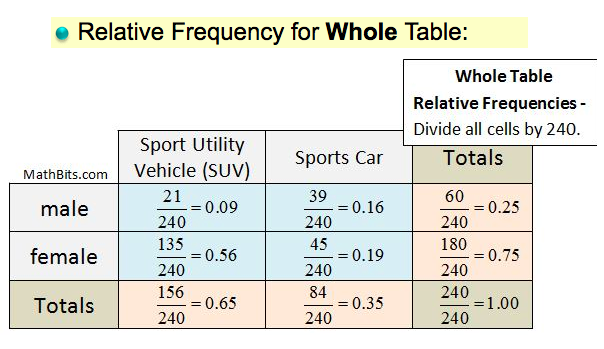

## Definitions

### `Two-way Table`
`Two-way Table` is a **`Joint distribution`**, which **rows** represent a kind of distribution, **columns** represent another kind of distribution.

### `Marginal Distribution`
`Marginal Distribution` is simply an **addon** to the joint distribution, that as a `TOTAL` row or column at the margins.

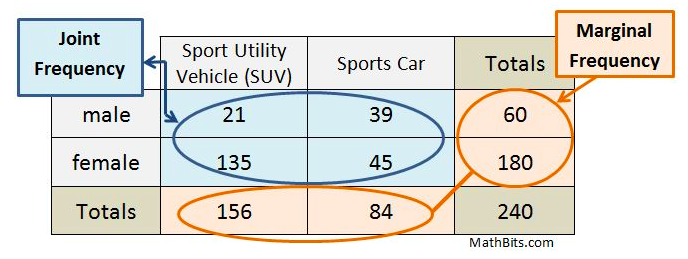

### `Conditional Distribution`
`Conditional Distribution` is **one column(variable)** in condition of another variable.

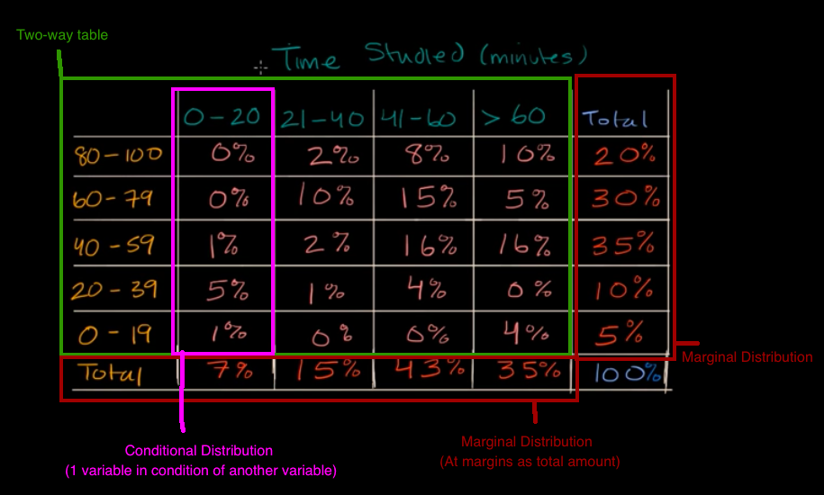

## `Trends in categorical data`

[Refer to Khan academy: Analyzing trends in categorical data](https://www.khanacademy.org/math/statistics-probability/analyzing-categorical-data/two-way-tables-for-categorical-data/v/analyzing-trends-categorical-data)
[Refer to Khan academy: Filling out frequency table for independent events](https://www.khanacademy.org/math/statistics-probability/inference-categorical-data-chi-square-tests/chi-square-tests-for-homogeneity-and-association-independence/v/frequency-table-independent-events)

[`▶ Practice on Khan academy: Trends in categorical data`](https://www.khanacademy.org/math/statistics-probability/analyzing-categorical-data/two-way-tables-for-categorical-data/e/trends-in-categorical-data)

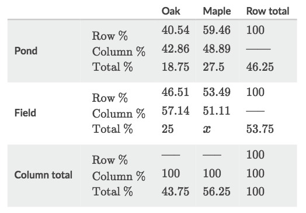

Interpret the table:
- `Row %`: shows how much proportion of the cell is on the `Row Total`. etc., the cell `Pond-Maple` is 59.46% of all samples by _pond_.
- `Column %`: shows how much proportion of the cell is on the `Column Total`. etc., the cell `Pond-Maple` is 48.89% of all _maples_ samples.
- `Total %`: shows how much proportion of the cell is on the `Sample Total`. etc., the cell `Pond-Maple` is 27.5% of all samples.

### Example
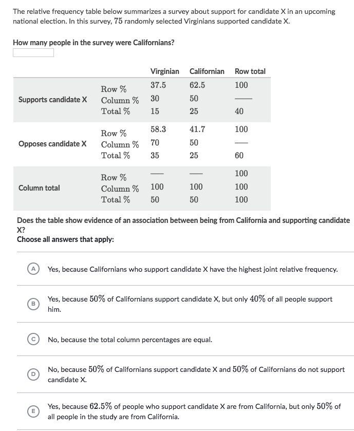
Solve:
- Get the total number of people:
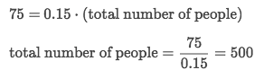
- Get the number of people from California: 500 * 0.5 = 250
- Analyze association. The logic is: **The event A & B has association if A takes a big part in B, EVEN IF B only takes a SMALL part in total samples.**
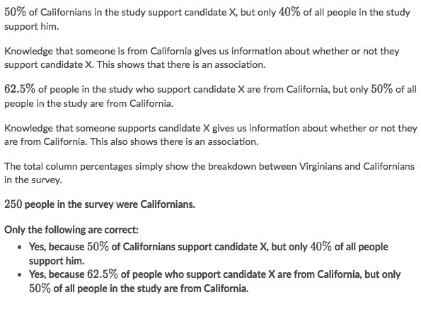

### Example
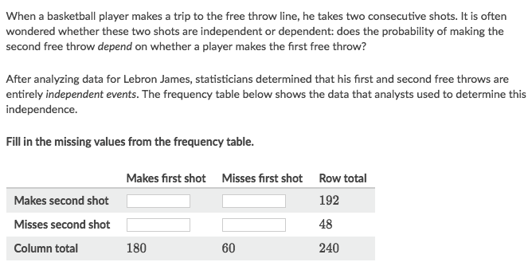
Solve:
- The answer is not precise but we're to guess it precisely.
- Been told those are entirely **independent** events, so we know that:
The probabilities are `P(makes 1st shot) = P(makes 2nd shot)`, and `P(misses 1st shot) = P(misses 2nd shot)`, regardless whether he makes or misses the 1st shot.
- We could get the **"fixed"** probability from the _marginal information_:
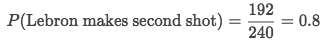
- And we apply the probability 80% to all "makes shot" cell to get:
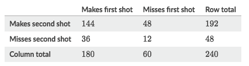

### Example
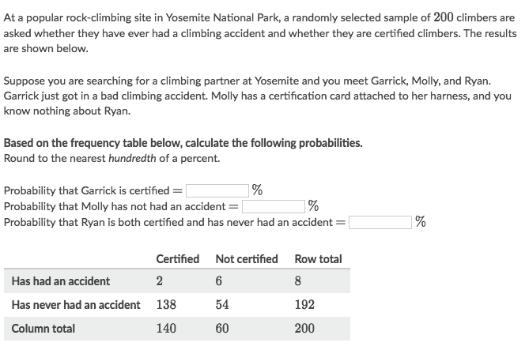
Solve:
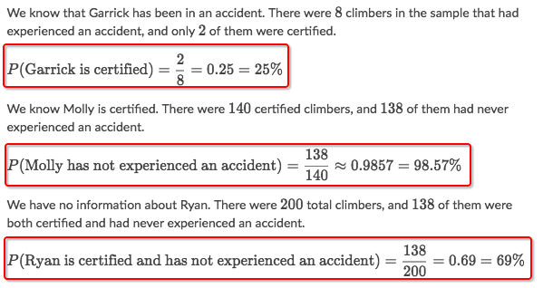

