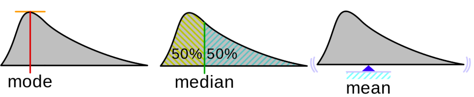
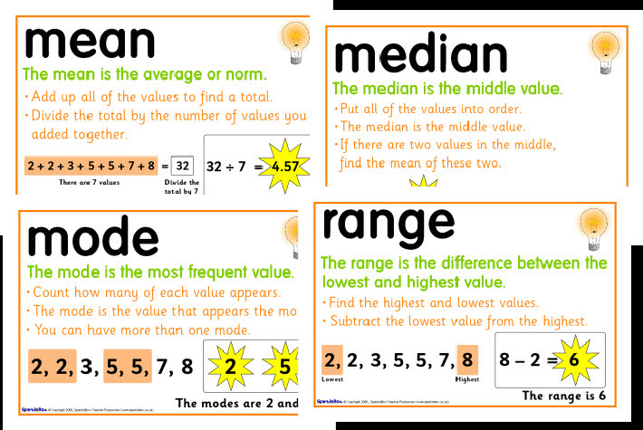

#  ❖ Central Tendencies: Mean, Median, Mode

> Which could represent the centres of a distribution.

[Refer to youtube: Mean, Median, and Mode: Measures of Central Tendency: Crash Course Statistics #3](https://www.youtube.com/watch?v=kn83BA7cRNM)
[Refer to wikipedia: Central tendency](https://www.wikiwand.com/en/Central_tendency)
[Refer to Khan lecture.](https://www.khanacademy.org/math/probability/data-distributions-a1/summarizing-center-distributions/v/mean-median-and-mode)

- `Mean` is just an average of all numbers listed.
- `Median` is the middle positioned number in a ordered `number set` (means no duplicates). If there're two middles, then average them to get a median number.
- `Mode` is the number shows up most times in a list.

## Impact on median & mean

There're some common impact:
- Increasing an outlier: 
- Removing an outlier: 

## `Average`
> `Average` in statistics means bit different than just a arithmetic average.

[Khan lecture.](https://www.khanacademy.org/math/probability/data-distributions-a1/summarizing-center-distributions/v/mean-median-and-mode)

`Average`: In stats, it means `typical` or `middle`, and could be represented by multiple ways:
- `Arithmetic mean`: Sum numbers and get average.
- `Median`: Sort numbers and get the MIDDLE one.
- `Mode`: A number repeats the most times in a dataset.
