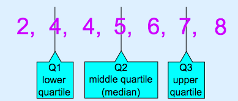
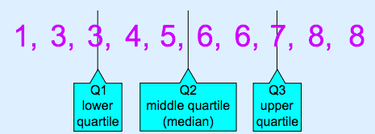
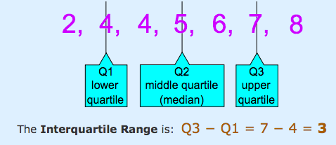
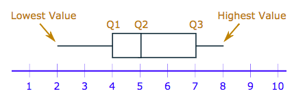
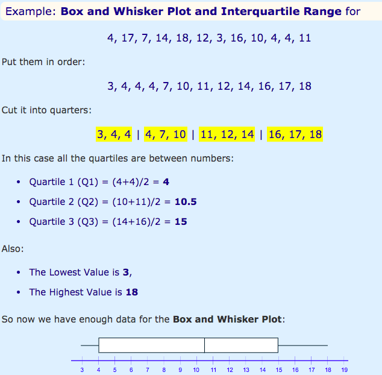
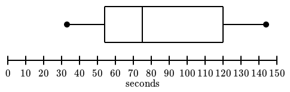
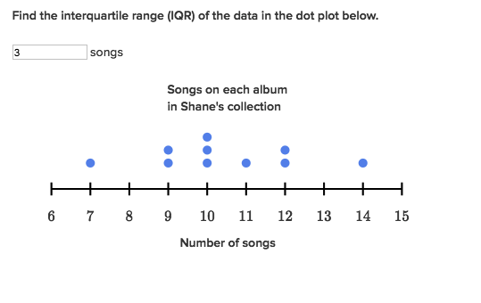

#  ❖ Quartiles and Box plots  (Distribution graph)
> It's also called `Box and whisker plots`, or `Five-number summary`.

[`▶︎ Jump over to Khan academy for practice: Comparing data distributions`](https://www.khanacademy.org/math/statistics-probability/displaying-describing-data/modal/e/interpreting-and-comparing-data-distributions)

[Refer to Khan academy: Reading box plots](https://www.khanacademy.org/math/probability/data-distributions-a1/box--whisker-plots-a1/v/reading-box-and-whisker-plots)
[Refer to Khan academy: Interpreting box plots](https://www.khanacademy.org/math/probability/data-distributions-a1/box--whisker-plots-a1/v/interpreting-box-plots)
[Refer to Maths is for fun: Quartiles](http://www.mathsisfun.com/data/quartiles.html)

Quartiles are the values that divide a list of numbers into quarters:

- Put the list of numbers **in order**
- Then cut the list into **4 equal parts**
- The Quartiles are **at the** "cuts"

or 

## 「Interquartile range」IQR (Box plot)
[Refer to Khan academy.](https://www.khanacademy.org/math/probability/data-distributions-a1/summarizing-spread-distributions/v/calculating-interquartile-range-iqr)

The `Interquartile Range` is from **Q1 to Q3**:

### Example

## 「Five-number Summary」
[Refer to Khan academy: Five-number summary](https://www.khanacademy.org/math/probability/data-distributions-a1/box--whisker-plots-a1/e/interpreting-quartiles-on-box-plots)

### Example

## 「Box and Whisker Plot」
`Box and Whisker Plot` can show all the important values.

Important values:
- Median: at Q2
- Interquartile Range: Q3-Q1
- Highest
- Lowest
- Shape: **Skewed Left or Right** if Q2 IS NOT in the middle of the Interquartile range.
- Mean: It DOES NOT show mean in the Box Plot unless it's a Normal Distribution which mean=median.

### Find out the 「Mean」 in Box plot
Although we can't find out the **mean value** from the Box Plot. But according to the **position** of the Q2 (the Median), we could know the relationship between the Mean & Median:
- If Q2 is at the middle in the `Interquartile`, it's probable a `Normal Distribution`, which `Median = Mean`
- If Q2 is at the **LEFT** in the `Interquartile`, it's probable a `Right Skewed Distribution`, which `Median < Mean`
- If Q2 is at the **RIGHT** in the `Interquartile`, it's probable a `Left Skewed Distribution`, which `Median > Mean`

### Example

### Example
At this graph below, according to the Q2 position, we know that the distribution shape is **`Skewed right`**

### Practice 

### Practice

