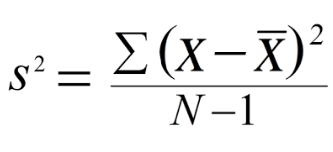
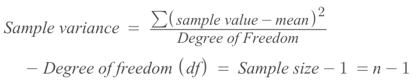
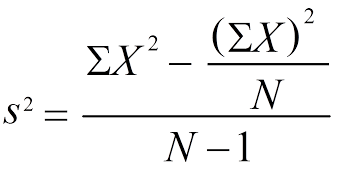
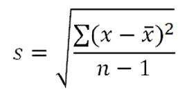
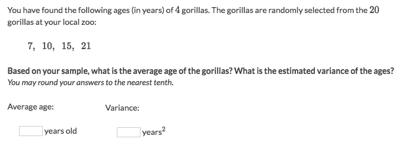
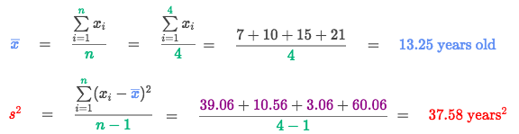

# Sample Variance

The Sample Variance, `s²`, is used to calculate how varied a sample is, 
and it's useful to estimate the **`Population Variance`**.

Since the Sample Variance is kind of estimation, so its formula is bit **different**.

## Why do we need to divide by `n-1`?

[Refer to Quora: Why is the formula of sample variance different from population variance?](https://www.quora.com/Why-is-the-formula-of-sample-variance-different-from-population-variance)

> "The sample variance is an **estimator** for the `population variance`. When applied to **sample data**, the population variance formula is **a biased estimator** of the population variance: it tends to **UNDERESTIMATE** the amount of variability. "

For solving this Underestimation problem, the statisticians found out that by dividing `n-1` we will solve this problem, regards to the idea of `degrees of freedom (DF)`.

## Easy way to calculate Sample Variance
This formula is better for handwriting calculation:

## `Sample Standard Deviation`

### Example

Solve:

> The age of any gorilla in our sample is likely to be closer to the average of the 4 gorillas we looked at instead of the average of all the gorillas in the zoo. 
Because of that, the squared deviations from the mean we calculated will probably **underestimate** the actual deviations from the population mean.
To compensate for this **underestimation**, rather than simply averaging the squared deviations from the mean, we total them and divide by `n-1`.
