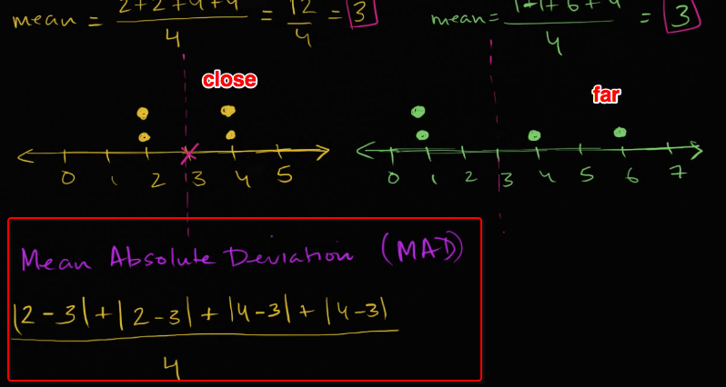

# 「Mean Absolute Deviation」 (MAD)
> The `Mean absolute deviation` is the absolute average of all deviations. 

`The deviation` is the distance from the value to the `mean` value. 
It's used to describe how the values looks like or how they're laid on the axis, are they close to each other or far away.

[Khan lectures.](https://www.khanacademy.org/math/cc-sixth-grade-math/cc-6th-data-statistics/cc-6-mad/v/mean-absolute-deviation)

