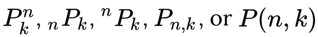
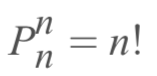
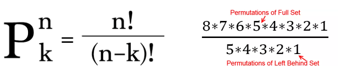
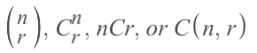
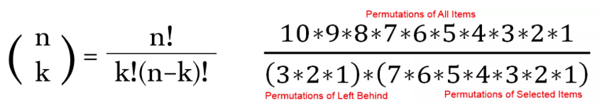

#  ❖ 「Permutations」 & 「Combinations」

> Aside from probability, `Permutations` and `Combinations` are essential tools for statistics.

They're to solve the problem: `how many groups are there of if we choose some from some.`

[`▶︎ Back to previous note on: Intro to probability`.](https://github.com/solomonxie/solomonxie.github.io/issues/50#issuecomment-409875416)

[`▶︎ Omni Permutation Calculator`](https://www.omnicalculator.com/statistics/permutation)
[`▶︎ Omni Combination Calculator`](https://www.omnicalculator.com/statistics/combination)

[Refer to article: Easy Permutations and Combinations](https://betterexplained.com/articles/easy-permutations-and-combinations/#!parentId=756)
[Refer to article: Permutations And Combinations Simplified](http://www.fairlynerdy.com/permutations_and_combinations_simplified/)
[Refer to article: Combinations vs Permutations](https://medium.com/i-math/combinations-permutations-fa7ac680f0ac)

**HOW MANY** `groups` do we get if we choose a number things from the total things?
e.g., `how many groups would there be if we choose 3 people from 9 people?`

Permutations and combinations are both to count `the total number of groups`. 
We got TWO types of ways to count:
- Permutation: **Order matters.**
- Combination: **Order DOES NOT matter.**

Combinations could be seen as **`FILTERED permutations`**, which filtered out all the "duplicates", or "over counted items".

e.g., We got different groups(Permutations) as "123, 132, 231, 213, 312, 321", once we filter out the over counted items, 
the `combination` is just one: `123`.

## 「Permutations」

> It's all the possible ways to **arrange/order** elements in a list.

### Notation

(Read as **N pick K**)

### Understanding 「Permutations」

Notice: `possibilities` ≠ `probabilities`

e.g., the `possibilities` of how to arrange three numbers 1,2,3?
It could be: `123, 132, 231, 213, 312, 321`, so answer is `6 possible ways`.
To count that algebraically, it'd be `3*2*1`, answer is `6 possible ways`.

How do we do this?

Possible ways to fit in the 1st position are 3, and we got 2 **left overs**. Then the 2nd place could have 2 possible ways, and we got 1 **left over**. So the 3rd position could be 1 possible way.

And just to logically think about it, we should MULTIPLY them together to get ALL POSSIBLE WAYS: `3*2*1`.

### Formula

- Full Permutations: (5 people sitting in 5 chairs)

- Pick Permutations (3 people sitting in 5 chairs):

## 「Combinations」

> Combination is a collection of elements which **the order DOESN'T matter**.

Based on permutations, we **filter out** the same combinations by dividing `k!` to get the combinations.

### Notation

(Read as **N choose R**)

### Formula

