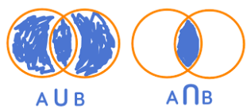
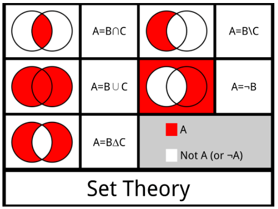
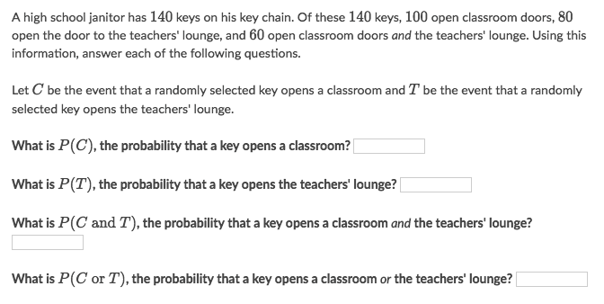
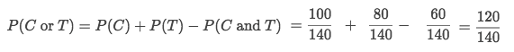

#  ❖ 「Set」 Basics

[Refer to wiki: Set](https://www.wikiwand.com/en/Set_(mathematics))
[Refer to Khan academy: Basic set operations](https://www.khanacademy.org/math/statistics-probability/probability-library/basic-set-ops/v/intersection-and-union-of-sets)

## 「Membership」
If B is a set and x is one of the objects of B, this is denoted x ∈ B, and is read as "x belongs to B", or "x is an element of B". If y is not a member of B then this is written as y ∉ B, and is read as "y does not belong to B".

## 「Subsets」
If every member of set A is also a member of set B, then A is said to be a subset of B, written A ⊆ B (also pronounced A is contained in B). Equivalently, we can write B ⊇ A, read as B is a superset of A, B includes A, or B contains A. 

### 「Empty Set」 ∅
The empty set is a subset of every set and every set is a subset of itself:
- ∅ ⊆ A.
- A ⊆ A.

### 「Universal Set」 U

Every set is a subset of the universal set:
A ⊆ U.

## `Basic Set Operations`

### 「Intersection」 ⋂, &, and

Examples:
- {1, 2} ∩ {1, 2} = {1, 2}.
- {1, 2} ∩ {2, 3} = {2}.

Basic properties of intersections:
- A ∩ B = B ∩ A.
- A ∩ (B ∩ C) = (A ∩ B) ∩ C.
- A ∩ B ⊆ A.
- A ∩ A = A.
- A ∩ U = A.
- A ∩ ∅ = ∅.
- A ⊆ B if and only if A ∩ B = A.

### 「Union」 ⋃, |, or

Examples:
- {1, 2} ∪ {1, 2} = {1, 2}.
- {1, 2} ∪ {2, 3} = {1, 2, 3}.
- {1, 2, 3} ∪ {3, 4, 5} = {1, 2, 3, 4, 5}

Basic properties of unions:
A ∪ B = B ∪ A.
A ∪ (B ∪ C) = (A ∪ B) ∪ C.
A ⊆ (A ∪ B).
A ∪ A = A.
A ∪ U = U.
A ∪ ∅ = A.
A ⊆ B if and only if A ∪ B = B.

### 「Complements」 \\, -, subtract
Two sets can also be "subtracted". 
The `relative complement` of `B in A` (also called the set-theoretic difference of A and B), denoted by `A \ B` (or `A − B`), is the set of all elements that are members of A but not members of B. 

Examples:
- {1, 2} \ {1, 2} = ∅.
- {1, 2, 3, 4} \ {1, 3} = {2, 4}.
- If U is the set of integers, E is the set of even integers, and O is the set of odd integers, then `U \ E = E′ = O`.

Basic properties of complements:
- A \ B ≠ B \ A for A ≠ B.
- A ∪ A′ = U.
- A ∩ A′ = ∅.
- (A′)′ = A.
- ∅ \ A = ∅.
- A \ ∅ = A.
- A \ A = ∅.
- A \ U = ∅.
- A \ A′ = A and A′ \ A = A′.
- U′ = ∅ and ∅′ = U.
- A \ B = A ∩ B′.
- if A ⊆ B then A \ B = ∅.

### Example

Solve:

